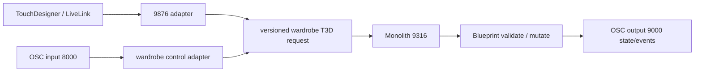

# Wardrobe T3D, LiveLink, OSC, and TouchDesigner Pipeline

## Normalized flow

## Commands

The stable CLI surface is in `Docs/T3D_Patterns/t3d.py`:

- `validate_wardrobe_nodes` — validation-only safe-wire transaction.
- `inject_wardrobe_node` — dry-run unless `--go` and an expected fingerprint
  are supplied.
- `validate_wardrobe_catalog` — checks the 39-record contract and 38 gacha
  drafts.
- `wire_wardrobe_battle_gate` — refuses unless `--enable-battle` is explicit;
  the runtime default remains disabled.

All writes route through `Tools/t3d_safe_wire.py`. The transaction records a
rollback graph, captures the pre-edit fingerprint, validates, mutates,
compiles with zero errors, asserts the post-edit graph, saves, re-exports, and
writes evidence beneath `Saved/T3D/`.

The request envelope is defined by
`specs/wardrobe/wardrobe_t3d_pipeline.v1.json`. External adapters may add
metadata, but only the normalized T3D payload reaches Monolith.
`Tools/validate_wardrobe_t3d_request.py` validates the normalized request
against the existing mutation schema and operation manifest without contacting
the editor; `specs/wardrobe/wardrobe_t3d_request.example.json` is the handoff
shape for future adapters.

## Health and fail-closed behavior

`Tools/wardrobe_bridge_health.py` probes TCP LiveLink 9876 and Monolith 9316.
OSC 8000/9000 is recorded as configured/unverified by default because UDP has
no listener acknowledgement; `--probe-udp` sends only an explicit zero-payload
probe. Unavailable or unverified bridges must not mutate Blueprint assets.

## Battle lane

The battle wardrobe path is staged behind `bEnableBattleWardrobe=false` and
the `wire_wardrobe_battle_gate` command. V2 promotion, catalog registration,
or lookbook equip cannot enable it as a side effect.
