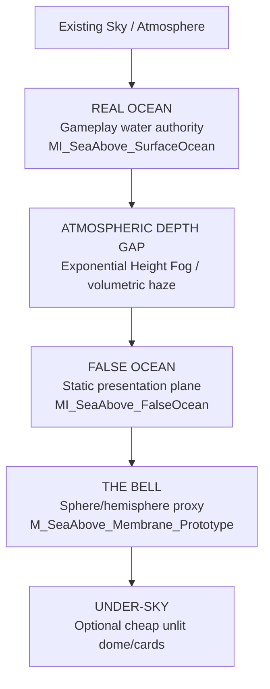
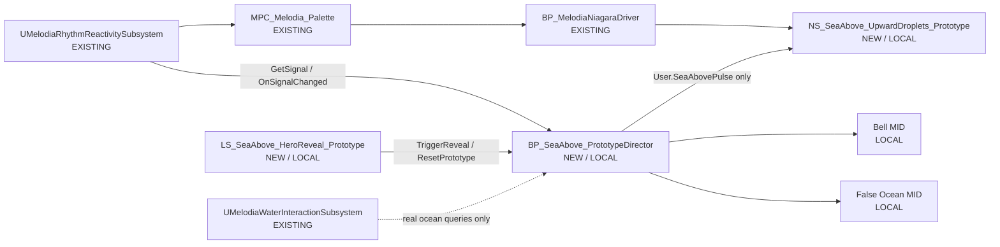
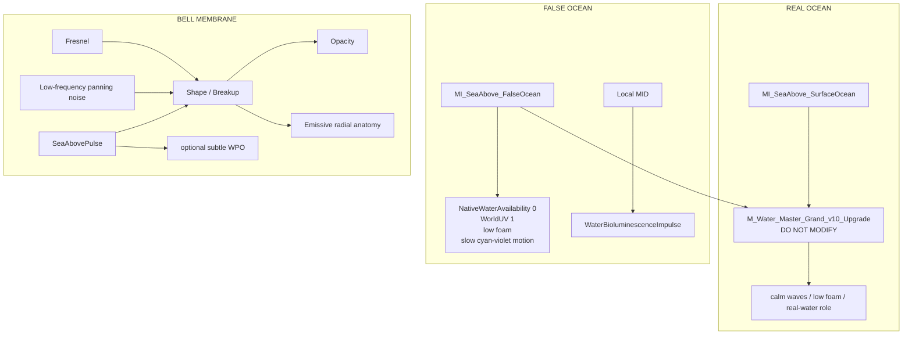

# Sea Above — Existing-System Integration + Visual / Shader Breakdown — 2026-08-26

Status: **execution-ready extension/correction** to `SEA_ABOVE_TONIGHT_EXECUTION_AND_AGENT_HANDOFF_2026-08-26.md`.

> **Rule:** Sea Above is not a new runtime stack. It is a local world-event layer composed on top of the current Water V10, rhythm-reactivity, Niagara, and water-interaction systems.

## 1. Verified existing systems to reuse

### Rhythm/material bus

Current shared collection:

`/Game/Melodia/_PROJECT/04_Materials/MPC_Melodia_Palette`

Do **not** use the older `MPC_Portfolio_Audio` assumption for Sea Above. `UMelodiaRhythmReactivitySubsystem` resolves `MPC_Melodia_Palette` as `AudioCollectionPath`.

Existing Blueprint-facing hooks on `UMelodiaRhythmReactivitySubsystem`:

- `Get`
- `GetSignal`
- `OnSignalChanged`
- `SetScalarOverride`
- `RegisterReactiveMeshComponent`
- `SetReactiveStencil`

Useful signal fields include `BeatPulse`, `BeatPhase`, `BPM`, `ComboNormalized`, `CrescendoNormalized`, `CommandEnergy`, `CommandPulse`, `BreakPulse`, `VictoryPulse`, `EnemyTension`, `TensionSustain`, `DissonanceAmount`, `WarmthGlow`, and `DreamRipple`.

### Niagara world driver

Existing actor:

`/Game/Melodia/VFX/BP_MelodiaNiagaraDriver`

It is the project-wide ambient/world Niagara fan-out and owns the standard shared `User.*` contract. Sea Above Niagara systems should consume that contract rather than creating a competing global VFX bus.

### Water gameplay authority

Existing world subsystem:

`UMelodiaWaterInteractionSubsystem`

Blueprint-facing hooks include `Get`, `QueryWaterAtLocation`, `QueryWaterAtLocationForActor`, `GetLatestSample`, `PublishContact`, `PublishFluidImpulse`, and the sample/contact/fluid delegates.

Sea Above rule: **only the real ocean is gameplay water**. The false ocean is never registered as a Water Body, never creates a Water Zone, and never submits samples to this subsystem.

### Water material authority

Production master:

`/Game/EnvSandbox/Materials/Masters/M_Water_Master_Grand_v10_Upgrade`

Keep it immutable. Reuse it only through new Sea Above instances.

## 2. Authoritative level stack



Perceptual sequence:

**normal coast → unreadable depth → second horizon → Bell pulse → biological realization**.

The fog gap is the primary scale trick. It prevents the player from reading the false ocean as “a second plane 150 m lower.”

## 3. Existing-system event flow



Authority split:

- `UMelodiaRhythmReactivitySubsystem` owns rhythm state.
- `MPC_Melodia_Palette` is the shared rhythm/audio/material bus.
- `BP_MelodiaNiagaraDriver` owns shared Niagara parameters.
- `UMelodiaWaterInteractionSubsystem` owns real gameplay-water queries/events.
- `BP_SeaAbove_PrototypeDirector` owns **only local Sea Above presentation state**.

## 4. BP_SeaAbove_PrototypeDirector

Create:

`/Game/EnvSandbox/Monoliths/SeaAbove/Prototype/Blueprints/BP_SeaAbove_PrototypeDirector`

Responsibilities:

- own autonomous Bell physiology Timeline;
- create/cache local Bell and false-ocean MIDs;
- read the existing rhythm subsystem;
- expose `TriggerReveal` and `ResetPrototype` for Sequencer;
- write `User.SeaAbovePulse` only on Sea Above Niagara components;
- never overwrite the standard shared Niagara contract;
- never register the false ocean as gameplay water.

### BeginPlay

```text
Event BeginPlay
  -> UMelodiaRhythmReactivitySubsystem::Get
  -> bind OnSignalChanged -> HandleRhythmSignal
  -> Create Dynamic Material Instance for Bell
  -> Create Dynamic Material Instance for False Ocean
  -> cache base WaterBioluminescenceImpulse
  -> set SeaAbovePulse = 0
  -> set User.SeaAbovePulse = 0 on local Sea Above VFX
```

Cache only the rhythm values Sea Above actually needs:

`BeatPulse`, `BeatPhase`, `CrescendoNormalized`, `CommandPulse`, `TensionSustain`, `DissonanceAmount`.

## 5. Bell physiology vs rhythm

The Bell is alive independently of music.

Create `TL_BellPulse`, first pass length `16.0 s`:

| Time | AutonomousPulse |
| ---: | ---: |
| 0.0 | 0.00 |
| 6.0 | 0.02 |
| 8.0 | 0.18 |
| 9.2 | 1.00 |
| 10.8 | 0.35 |
| 16.0 | 0.00 |

Never call `NotifyBeat` to manufacture Bell physiology.

Rhythm is a small entrainment layer:

```text
RhythmAccent = BeatPulse*0.10 + CommandPulse*0.08 + Crescendo*0.06
DreadAccent  = saturate(TensionSustain)*0.05
FinalSeaAbovePulse = saturate(AutonomousPulse + RhythmAccent + DreadAccent)
```

Those weights are lookdev starting points, not gameplay constants.

Do **not** use `SetScalarOverride` for the local Bell pulse; it writes to the shared MPC. Local physiology belongs on local MIDs/VFX parameters.

## 6. Local writes on pulse

```text
BellMID.SeaAbovePulse = FinalSeaAbovePulse

FalseOceanMID.WaterBioluminescenceImpulse =
    lerp(BaseFalseBioImpulse, PulseBioPeak, FinalSeaAbovePulse)

SeaAboveVFX.User.SeaAbovePulse = FinalSeaAbovePulse
```

Start `PulseBioPeak` around `0.5–0.65`, then tune down if the horizon becomes gaudy or clips.

## 7. Niagara integration

Prototype system:

`NS_SeaAbove_UpwardDroplets_Prototype`

Recommended simple stack:

```text
Emitter State
-> Spawn Rate
-> Initialize Particle
-> Shape Location
-> Add Velocity (+world Z)
-> Particle State
-> optional Drag / Curl Noise
-> Scale Color
-> Solve Forces and Velocity
-> Sprite Renderer
```

Use the existing shared contract where applicable (`User.Intensity`, `User.BeatPulse`, audio bands, `User.PlayerProximity`, etc.), then add one local parameter:

`User.SeaAbovePulse`

Writer ownership:

```text
BP_MelodiaNiagaraDriver -> standard shared User.*
BP_SeaAbove_PrototypeDirector -> User.SeaAbovePulse only
```

Requirements when promoted to project-owned reusable status:

- fixed bounds;
- warmup 0;
- quiet at rest;
- compile clean;
- run `python Tools/niagara_ecosystem_audit.py --contract`.

Do not base tonight’s effect on `NS_Uni_WaterMist` while its documented stale graph errors remain unresolved.

## 8. Water lookdev

### Real ocean

Create:

`MI_SeaAbove_SurfaceOcean`

Preferred duplicate source:

`MI_WaterV10_Integrated_CalmPond`

Fallback:

`MI_WaterV10_Integrated_RiverClear`

Target: calm, readable, low foam/ripple, little visible bioluminescence at rest, world-UV behavior preserved.

This can remain genuine Water Body presentation and continue to be queryable by `UMelodiaWaterInteractionSubsystem`.

### False ocean

Create:

`MI_SeaAbove_FalseOcean`

Preferred duplicate source:

`MI_WaterV10_Integrated_CinematicHero`

Fallback if visually too busy:

`MI_WaterV10_Integrated_OceanPreview`

Starting intent:

- `NativeWaterAvailability = 0`
- preserve `WaterV10WorldUVBlend = 1`
- world texture scale around `0.0012` as a lookdev starting point
- aggressively reduce foam contributions
- very slow motion
- cyan → violet/indigo palette
- retain controlled bioluminescence for Bell response

The false ocean is a **static presentation plane** and is not part of gameplay-water authority.

## 9. Shader breakdown



### M_SeaAbove_Membrane_Prototype

Recommended tonight:

- Surface material;
- Translucent;
- Unlit;
- Two Sided only if framing requires it.

Inputs:

- Fresnel;
- low-frequency panning noise;
- radial mask/pattern;
- Bell tint vector;
- base opacity;
- base emission;
- `SeaAbovePulse`.

Suggested logic:

```text
Edge = pow(Fresnel, FresnelExponent)
Breakup = lerp(0.65, 1.0, PanningNoise)
RadialReveal = saturate(RadialPattern * SeaAbovePulse)

Opacity = BaseOpacity * Edge * Breakup
        + RadialReveal * PulseOpacityContribution

Emissive = BellTint * (BaseEmission + RadialReveal * PulseEmission)
```

Optional WPO:

`VertexNormalWS * BellPulseDisplacement * SeaAbovePulse`

Keep displacement tiny relative to the perceived creature size. The Bell should **breathe**, not bounce.

## 10. Under-sky

Optional:

`M_SeaAbove_UnderSky_Prototype`

Cheap unlit dome/cards with:

- emissive sky gradient;
- cloud/noise texture;
- extremely slow pan;
- zero gameplay authority.

Drop this before dropping the Bell pulse if time becomes constrained.

## 11. Sequencer

Create:

`LS_SeaAbove_HeroReveal_Prototype`

| Time | Beat |
| ---: | --- |
| 0–8 s | normal coast / approach |
| 8–14 s | false second horizon becomes readable |
| ~14 s | event calls `TriggerReveal` |
| 14–22 s | Bell pulse and local environment response |
| 22–27 s | hold for biological comprehension |
| 27–30 s | optional quiet tail |

Call `ResetPrototype` before each take. Do not rebuild the Level Blueprint for the reveal.

## 12. Future gameplay seam

Tonight does not implement gravity inversion or swimming transitions.

When Sea Above graduates, prototype one separate suspended/inverted playable-water cell that uses existing `UMelodiaWaterInteractionSubsystem` query semantics.

Future rule:

`presentation false ocean != playable water volume`

Do not mutate tonight’s fake horizon plane into gameplay authority later; build a clear real-water/traversal object for that job.

## 13. Agent handoffs

### ENV
Owns prototype map, planes, Bell placement, fog gap, under-sky, hero camera. Must not edit production Water masters/subsystems.

### WATER
Owns `MI_SeaAbove_SurfaceOcean` and `MI_SeaAbove_FalseOcean`. Must not edit the V10 master or source integrated MIs. Handoff must include parent names + parameter deltas.

### BELL
Owns `M_SeaAbove_Membrane_Prototype`, MI, and primitive presentation. Handoff must document exposed parameters and off/on-pulse evidence.

### VFX
Owns Sea Above Niagara prototypes. Shared parameters come from `BP_MelodiaNiagaraDriver`; `User.SeaAbovePulse` comes only from the Sea Above director.

### RHYTHM / PRESENTATION
Owns `BP_SeaAbove_PrototypeDirector`, subsystem readback, autonomous physiology, local MIDs, local VFX pulse, `TriggerReveal`, and `ResetPrototype`.

### QA / CAPTURE
Owns Sequencer, repeatability, compile/runtime checks, screenshots/MRQ evidence, and Git diff review.

## 14. Stop conditions

Stop/fallback rather than expand scope if:

- the proof requires editing `M_Water_Master_Grand_v10_Upgrade`;
- the false ocean needs a second Water Zone;
- the director needs new C++;
- Niagara needs NDC or FLIP;
- Sea Above needs a new global MPC;
- any agent needs to overwrite the global Niagara contract;
- the Bell requires a production creature rig/model;
- World Partition authoring becomes necessary;
- a production Water instance shows unexplained modification;
- `UMelodiaWaterInteractionSubsystem` resolves the false ocean as gameplay water.

## 15. Validation gates

BP/event flow:

- director compiles with zero errors;
- `TriggerReveal` repeats;
- `ResetPrototype` restores baselines;
- no fake `NotifyBeat` calls;
- no global MPC override needed for local physiology.

Niagara:

- prototype compiles;
- fixed bounds / warmup 0;
- shared contract has one writer;
- local pulse has one writer.

Water:

- canonical V10 master unchanged;
- integrated source MIs unchanged;
- false ocean is not a Water Body;
- water queries resolve only real gameplay water.

Visual:

- 16:9 hero frame;
- real ocean reads first;
- false horizon reads as impossible space before anatomy;
- Bell perimeter remains hidden;
- pulse creates the biological realization;
- one clean 20–30 second replay passes.

## 16. Git / agent protocol

This documentation branch is stacked on the current safe docs batch. Unreal binary implementation should be a separate implementation branch with asset locks/ownership.

Recommended later implementation commits:

```text
feat(sea-above): block out prototype level and water looks
feat(sea-above): add bell membrane and local pulse director
feat(sea-above): add contract-compliant anomaly VFX
feat(sea-above): add hero reveal sequence
test(sea-above): record runtime validation
```

Every handoff:

```text
Lane:
Branch:
Assets edited:
Existing systems read:
Existing systems written:
New local parameters:
Compile status:
Runtime proof:
Screenshots / capture:
Known issues:
Do-not-touch reminders:
Next owner:
```

## Definition of architectural success

Sea Above is correctly integrated when every Sea Above prototype asset could be removed and the existing Water V10, rhythm-reactivity, Niagara driver, and water-interaction systems would remain unchanged and healthy.

> **Compose with the game; do not fork the game.**
