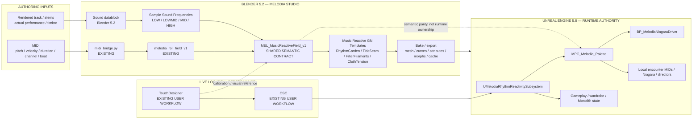
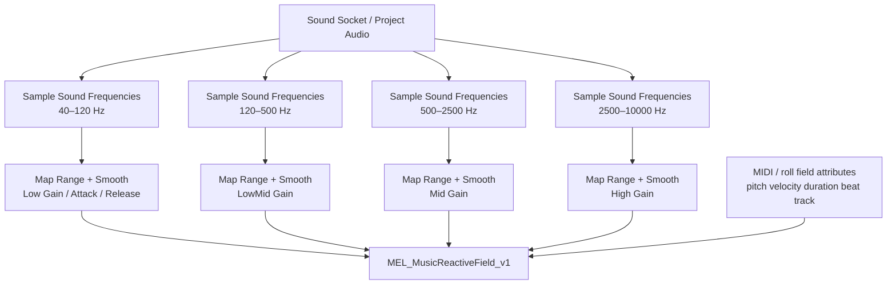
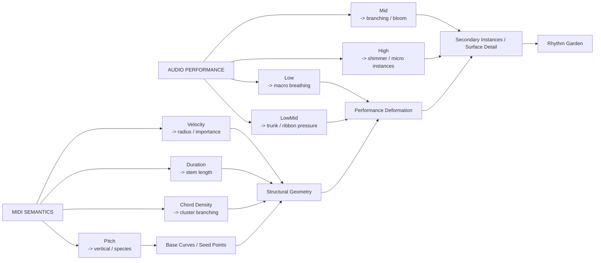

# Melodia Music Signal Bridge — TouchDesigner + Blender 5.2 + Unreal

**Date:** 2026-08-30  
**Branch:** `rnd/2026-08-30-blender52-music-gn-studio`  
**Status:** integration contract / visual implementation guide  
**Related:**
- `Docs/Blender/MELODIA_STUDIO_BLENDER52_MUSIC_TO_NODES_INTEGRATION_PLAN_2026-08-30.md`
- `Docs/Handoffs/MELODIA_STUDIO_GN_INSTRUMENTS_HANDOFF_2026-08-25.md`
- `Docs/Art/SEA_ABOVE_SYSTEM_INTEGRATION_VISUAL_SHADER_BREAKDOWN_2026-08-26.md`
- Issue #34 / PR #35

Visual companion:
- `Docs/Blender/Images/melodia_music_signal_bridge_td_blender_unreal_2026-08-30.svg`

---

## Why this is better than a standalone Blender audio-reactive tool

The project already has two mature halves:

1. **Melodia Studio MIDI semantics** — MIDI parsing, musical presets, roll-field data, generated musical geometry, and existing Geometry Nodes tooling.
2. **Unreal rhythm/material runtime** — `UMelodiaRhythmReactivitySubsystem`, `MPC_Melodia_Palette`, Niagara fan-out, local MIDs, and project-specific rhythm signals such as `BeatPulse`, `CrescendoNormalized`, `TensionSustain`, `DreamRipple`, etc.

The user also already has a **live TouchDesigner -> OSC -> Unreal/MPC workflow** that drives similar audiovisual parameters.

Therefore Blender 5.2's Sound sockets / `Sample Sound Frequencies` should not become a third unrelated system. It should become the **offline authoring twin** of the live TouchDesigner / Unreal signal lane.

> **One semantic music language, three execution contexts.**

- TouchDesigner = live performance / rapid signal lookdev.
- Blender 5.2 = offline procedural authoring / geometry generation.
- Unreal = runtime gameplay authority and final presentation.

---

# 1. Master architecture



The dotted connection is the critical rule: **Blender and Unreal share meanings, not authority or live state.**

---

# 2. Existing Unreal signal vocabulary to preserve

The current rhythm/material bus is:

`/Game/Melodia/_PROJECT/04_Materials/MPC_Melodia_Palette`

The existing rhythm subsystem exposes useful fields including:

```text
BeatPulse
BeatPhase
BPM
ComboNormalized
CrescendoNormalized
CommandEnergy
CommandPulse
BreakPulse
VictoryPulse
EnemyTension
TensionSustain
DissonanceAmount
WarmthGlow
DreamRipple
```

Do not rename these inside Unreal merely to match Blender terminology.

Instead, Melodia Studio should expose **preview aliases** and explicit mapping presets.

---

# 3. Shared semantic contract

V1 contract name:

`melodia_music_signal_v1`

The contract is conceptual first. It can later become a JSON manifest used by Studio, TouchDesigner tooling, and UE audit scripts.

## 3.1 Transport / timing

| Canonical semantic | Blender source | TouchDesigner source | Unreal target |
|---|---|---|---|
| `tempo_bpm` | MIDI tempo map / manual | existing live analysis / transport | `BPM` |
| `beat_phase` | MIDI normalized beat | live OSC phase | `BeatPhase` |
| `beat_pulse` | note/grid impulse or envelope | live transient/beat OSC | `BeatPulse` |
| `phrase_progress` | MIDI phrase normalization | optional TD phrase/chapter channel | local authoring only unless mapped |

## 3.2 Musical structure

| Semantic | Source | Purpose |
|---|---|---|
| `note_pitch` | MIDI | vertical placement, species selection, shape family |
| `note_velocity` | MIDI | thickness / importance / bloom potential |
| `note_duration` | MIDI | curve length / persistence / architectural span |
| `track_id` | MIDI | instrument/material/ecology family |
| `chord_density` | MIDI-derived | cluster density / branching complexity |

These remain **authoring semantics**. They are not required as MPC fields.

## 3.3 Spectral/performance energy

Blender V1 bands:

```text
spectral_low       40–120 Hz
spectral_lowmid    120–500 Hz
spectral_mid       500–2500 Hz
spectral_high      2500–10000 Hz
```

These are not automatically identical to any current Unreal channel.

They feed a mapping layer.

Example mappings:

```text
spectral_low     -> preview.world_breath
spectral_lowmid  -> preview.structural_pressure
spectral_mid     -> preview.branch_energy
spectral_high    -> preview.shimmer
```

Then a preset may deliberately map those to existing runtime concepts:

```text
MONOLITH_BREATH
preview.world_breath          -> DreamRipple / local physiology preview
preview.structural_pressure   -> TensionSustain preview
preview.branch_energy         -> CommandEnergy preview
preview.shimmer               -> local material emission / Niagara density
```

No direct mapping should be assumed globally.

---

# 4. Detailed Blender node-flow — MEL_MusicReactiveField_v1



Recommended outputs exposed to templates:

```text
Music.Low
Music.LowMid
Music.Mid
Music.High
Music.BeatPulsePreview
Music.BeatPhasePreview
Music.PhraseProgress
Music.Pitch
Music.Velocity
Music.Duration
Music.TrackId
Music.ChordDensity
```

Do not expose FFT mechanics directly to every template. Templates consume a stable semantic group.

---

# 5. First production-shaped template — MEL_GN_RhythmGarden_v1

The first benchmark should answer:

> **Does hybrid musical data create environment forms that feel composed rather than merely audio-reactive?**



Suggested first mappings:

```text
pitch            -> seed Z / radial family / species index
velocity         -> base radius + bloom ceiling
duration         -> curve extension
track/channel    -> branch material family
chord density    -> branch count

low              -> global breathing / Set Position
low-mid          -> curve radius pressure
mid              -> branch growth / instance probability
high             -> micro blooms / pearl shimmer / pollen markers
```

The goal is not an equalizer sculpture. The goal is a **musical organism**.

---

# 6. TouchDesigner bridge: use it as calibration, not another authority

The existing live TouchDesigner/OSC workflow is valuable because it already proves a live performance-to-visual-control loop.

We should use it in three ways.

## A. Signal naming reference

Where the TD patch already has meaningful channel names, record them rather than reinventing equivalents in Blender.

Example future manifest entry:

```json
{
  "semantic": "beat_pulse",
  "touchdesigner_osc": "/melodia/beat/pulse",
  "unreal": "BeatPulse",
  "blender_preview": "Music.BeatPulsePreview"
}
```

The OSC address above is an **example placeholder** until the existing TD network is inspected. Do not change the live TD setup just to match this example.

## B. Curve calibration

If TouchDesigner already has a response that feels good, use it as a reference for Blender smoothing/gain.

For the same audio phrase:

```text
TD low-band response
vs
Blender Music.Low
```

Compare:
- latency;
- attack;
- release;
- normalization;
- peak response;
- quiet-floor behavior.

We do not need numerical identity. We need **similar artistic meaning**.

## C. Optional later live-preview fanout

V1 does not require Blender to receive OSC.

Later, if useful:

```text
TouchDesigner
     |
     +--> OSC -> Unreal runtime preview
     |
     +--> OSC -> Blender custom properties -> GN live lookdev
```

This would let a live performance drive both UE and Blender previews simultaneously, but it is explicitly **Phase 2 / optional** because Blender 5.2 file-based Sound sampling already covers the immediate authoring need.

---

# 7. Runtime ownership — non-negotiable

Shipping architecture remains:

```text
Music / gameplay events
      -> UMelodiaRhythmReactivitySubsystem
      -> MPC_Melodia_Palette
      -> materials / Niagara / local encounter presentation
```

Blender outputs:
- meshes;
- curves;
- attributes;
- texture/field source data;
- shape keys;
- cached animation where justified;
- provenance sidecars.

Blender does **not** output runtime timing authority.

TouchDesigner does **not** become a required shipping dependency unless independently justified later.

---

# 8. Recommended Studio UI after TD/OSC discovery

```text
MUSIC REACTIVE GEOMETRY

Mode
[ MIDI ] [ AUDIO ] [ HYBRID ]

MIDI Source
[ existing selector ............ ]

Audio Source
[ project audio / stem ......... ]

Signal Preset
[ Melodia Balanced v ]

Template
[ Rhythm Garden v ]

[ Build Music Signal Rig ]
[ Sync Audio Preview ]
[ Generate Study ]

Signal Preview
Beat      ███████░░
Low       █████░░░░
LowMid    ██████░░░
Mid       ████░░░░░
High      ██░░░░░░░

Advanced >
```

Advanced contains FFT size, window function, manual band ranges, gain, smoothing, attack/release—not the default panel.

---

# 9. Signal presets

## Melodia Balanced

General-purpose authoring.

```text
Low       40–120 Hz
LowMid    120–500 Hz
Mid       500–2500 Hz
High      2500–10000 Hz
```

Moderate smoothing on all bands.

## Monolith Breath

Purpose: P0 Bell physiology / P3 atmospheric feeding / late Monolith motion studies.

```text
Low       high influence
LowMid    medium-high influence
Mid       low-medium influence
High      low influence except particles/details
```

Maps toward:
- `DreamRipple`-like presentation;
- `TensionSustain`-like pressure;
- local physiology parameters.

## Wardrobe

Purpose: hems, ribbons, jewelry, shimmer, secondary motion studies.

```text
Low       low-medium
LowMid    medium
Mid       high
High      high
```

Maps toward:
- cloth tension;
- trim flutter;
- pearl/glass shimmer;
- embroidery activation.

## Horizon Filter

Purpose: P3 filter-flow ecology.

```text
Low       horizon inhale / global field pressure
LowMid    grass / canopy leaning strength
Mid       pollen / seed flow density
High      shimmer / micro particulate response
```

---

# 10. Melodia-specific target templates

## `MEL_GN_RhythmGarden_v1`

Hybrid music -> botanical/biological authored forms.

## `MEL_GN_TideSeam_v1`

MIDI phrase -> seam topology; spectral performance -> seam width, ripple, translucent edge motion.

## `MEL_GN_FilterFilaments_v1`

MIDI structure -> filter-plate/filament spacing; spectral energy -> current pressure and particulate detail.

## `MEL_GN_ClothTensionStudy_v1`

MIDI event graph -> anchor/seam hierarchy; performance energy -> fold tension and delayed pull behavior.

These templates should all consume `MEL_MusicReactiveField_v1`, never instantiate their own unrelated sound-analysis networks.

---

# 11. Immediate implementation sequence

## Step 1 — inspect live TD mapping

Do not rewrite it.

Record:
- OSC address names;
- normalization range;
- smoothing / lag;
- what reaches `MPC_Melodia_Palette` directly versus subsystem/local code;
- which channels are artistic lookdev-only.

Output:
`Docs/Blender/MELODIA_TD_OSC_SIGNAL_MAP_CAPTURE_2026-08-30.md`

## Step 2 — Blender API proof

Build one `Sample Sound Frequencies` node for 40–120 Hz and drive curve radius.

## Step 3 — create `MEL_MusicReactiveField_v1`

Four bands + MIDI semantic inputs + stable named outputs.

## Step 4 — Rhythm Garden

Use the same MIDI/audio phrase already used in the live TD experiment if possible. This gives a direct three-way comparison:

```text
TouchDesigner visual response
Blender authored geometry response
Unreal runtime material/VFX response
```

## Step 5 — parity audit

Do not ask whether the numbers match exactly.

Ask whether:
- beat means beat everywhere;
- crescendo means increasing structural/emotional energy everywhere;
- tension means sustained pressure everywhere;
- dream/ripple means slow low-frequency world deformation everywhere.

## Step 6 — export to UE

First target should be conventional geometry/curves + provenance sidecar.

---

# 12. V1 acceptance criteria

The bridge is successful if:

- existing MIDI Studio tools remain green;
- Blender Sound frequency sampling works with project audio;
- Studio builds `MEL_MusicReactiveField_v1` automatically;
- one phrase can produce `MEL_GN_RhythmGarden_v1` in under ~10 minutes after setup;
- MIDI and spectral channels remain separately inspectable;
- signal presets use language compatible with existing Unreal rhythm concepts;
- no Blender or TouchDesigner runtime dependency is introduced into shipping UE;
- TD live lookdev can be used as a reference without becoming coupled to Blender implementation;
- exported result can be imported into UE as ordinary project assets;
- Unreal rhythm subsystem remains runtime authority.

---

# 13. Core doctrine

> **MIDI describes the composition. Audio describes the performance. TouchDesigner proves the live response. Blender authors form from the same musical language. Unreal owns the world when the player arrives.**
