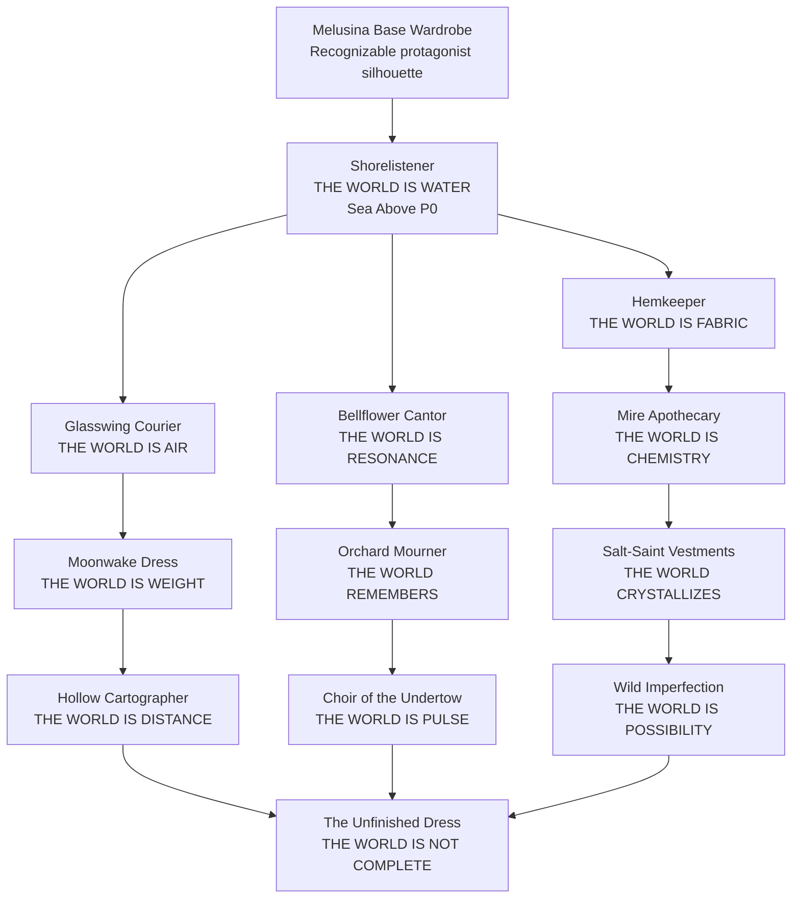

# Melusina Wardrobe Progression + World-Interpretation Tree — 2026-08-28

Status: **canonical design direction / flexible chapter ordering after P0**  
Scope: wardrobe progression, exploration verbs, rhythm interaction, Monolith/world interpretation, visual-complexity escalation, reusable environment anchors, concept-art and CLO handoff guidance.

> **Core doctrine:** Melusina's outfits are not merely ability costumes. Each outfit is a different theory about what the world *is*, and therefore a different way to perceive and manipulate the same authored spaces.

Sea Above / Shorelistener is the locked P0 entry point. Everything after it is intentionally modular and may move as chapter structure evolves.

---

## 1. Why the wardrobe progression exists

The wardrobe pillar should accomplish four things at once:

1. **Exploration progression** — new outfits open traversal and environmental interactions.
2. **Rhythm expression** — timing quality changes stability, duration, truth revealed, or route quality rather than simply adding damage.
3. **Worldbuilding** — each outfit teaches a different interpretation of reality.
4. **Monolith escalation** — early outfits manipulate local phenomena; later outfits reveal that the same rules apply to geography, anatomy, distance, memory, and incomplete reality.

The player should begin with a readable fantasy-game assumption:

> "This dress gives me a water ability."

The game should gradually turn that into:

> "Different garments make different versions of the world become true."

Late-game implication:

> "These outfits may not be granting powers at all. They may be choosing which ontology Melusina is allowed to inhabit."

---

## 2. Visual progression rule

Outfit progression must not mean "every later outfit has more embroidery." Use a controlled escalation of **silhouette idea -> material idea -> reality-breaking idea**.

### Early outfits

- Preserve most of Melusina's recognizable base silhouette.
- Add **one dominant silhouette idea**.
- Keep ornament count intentionally limited.
- Let material reactions provide most of the magic.
- The first unlock should remain believable as a garment she could actually wear while exploring.

### Midgame outfits

- Add one significant new material language.
- Allow more dramatic asymmetric panels, weight distribution, layered cloth, hard-soft contrast, or reactive accessories.
- Begin visibly changing how the environment behaves around the garment.

### Late-game outfits

- May challenge the stable silhouette itself.
- Garment boundaries may disappear, repeat, remain unfinished, map onto distant geometry, or temporarily become environmental structures.
- Fashion becomes a world-state interface.

**Production rule:**

> Early outfits add one silhouette idea. Midgame outfits add one material idea. Late outfits are allowed to change the rules of silhouette itself.

---

## 3. High-level progression tree

This is a **conceptual tree**, not a mandatory unlock order. Multiple chapters may provide outfits in a different sequence while preserving the escalation.

---

## 4. Tentative chapter placement

### P0 / first public slice — Sea Above

**Outfit:** Shorelistener  
**Interpretation:** The world is water.  
**Purpose:** teach the wardrobe pillar in the simplest, most readable form.

### Early game flexible slots

Recommended next three:

- Glasswing Courier — expands traversal without requiring world-state reconstruction.
- Bellflower Cantor — makes rhythm itself an exploration verb.
- Hemkeeper — sets up the Faraway Mother/fabric-geography mythology.

These three establish the initial grammar:

**fluid -> air -> resonance -> fabric**.

### Midgame

- Moonwake Dress
- Mire Apothecary
- Orchard Mourner
- Salt-Saint Vestments

These make the environment feel increasingly interpretable rather than merely traversable.

### Late-midgame / late game

- Hollow Cartographer
- Choir of the Undertow
- Wild Imperfection
- The Unfinished Dress

These should coincide with Monoliths whose effects cannot be explained as ordinary elemental magic.

---

# 5. Outfit specifications

## 5.1 Shorelistener

**Statement:** *The world is water.*  
**Role:** first unlockable exploration outfit / Sea Above P0.  
**Complexity:** Tier 1 — restrained.

### Visual thesis

Keep Melusina's familiar puff-sleeve / fitted-bodice / skirt-apron language. Add only:

- one asymmetric translucent **Shorelistener Hem**;
- one small Second Horizon clasp/brooch;
- one broad tide gradient or hand-painted motif;
- modest pearl/sea-glass accents.

Her existing translucent hair carries much of the visual complexity.

### Core verb — Hem of the Second Sea

Melusina detects **Tide Seams** where two bodies/states of water almost touch.

Near a seam:

- translucent hem leans against gravity;
- hair tips follow the same vector;
- droplets crawl upward;
- tide-line material response intensifies.

At activation, Melusina temporarily "stitches" waters together.

### Applications

- **Fall Stitch** — redirect water vertically / create upward waterfall traversal.
- **Current Stitch** — form a temporary traversable flow ribbon.
- **Pool Stitch** — connect two authored pools/portals.
- **Buoyancy Stitch** — briefly fall upward through a current.

### Rhythm relationship

Access is never denied for imperfect timing.

- basic timing = main path works;
- good timing = longer duration or safer path;
- excellent timing = optional branch/reward;
- perfect resonance = brief impossible truth/Monolith foreshadowing.

### Monolith connection

Sea Above teaches that Tide Seams are not generic elemental magic. They are evidence of incompatible water states around the Bell.

---

## 5.2 Glasswing Courier

**Statement:** *The world is air.*  
**Role:** early traversal expansion.  
**Complexity:** Tier 1–2.

### Visual thesis

- shorter/lighter skirt treatment;
- translucent shoulder fins or trailing scarf-panels rather than literal wings;
- compact courier hardware;
- practical boots retained.

### Core verb — Pressure Reading

Air currents become authored traversal geometry.

- ride pressure streams;
- redirect short wind channels;
- launch from thermal columns;
- perform controlled soft glides.

Avoid unrestricted flight.

### Shared-anchor reinterpretation

A node that Shorelistener reads as a vertical current may be read by Glasswing as a thermal or pressure lift.

### Rhythm relationship

Timing affects lift stability and route precision, not whether the player can use the system at all.

---

## 5.3 Hemkeeper

**Statement:** *The world is fabric.*  
**Role:** Faraway Mother setup / structural traversal.  
**Complexity:** Tier 2.

### Visual thesis

- longer split overskirt;
- visible but elegant seam language;
- one measuring-ribbon or tailor-tool motif;
- restrained exposed stitching;
- avoid making the entire outfit look torn or ragged.

### Core verb — World Seam

The outfit reveals **Seam Anchors** in authored structures and landscapes.

Actions:

- stitch broken bridge segments;
- unpick barriers;
- tighten loose hanging structures;
- pull authored terrain folds into temporary ramps;
- close dangerous tears temporarily.

### Escalation

Early: fabric-like machinery/architecture responds.  
Later: cliffs and mountain folds respond identically.  
Faraway Mother reveal: the player has been using tailoring logic on geography because part of the geography is clothing.

### Rhythm relationship

Rhythm maintains tension. Poorer timing causes faster loosening, not hard failure.

---

## 5.4 Bellflower Cantor

**Statement:** *The world is resonance.*  
**Role:** first outfit where rhythm itself becomes the direct exploration verb.  
**Complexity:** Tier 2.

### Visual thesis

- fluted/petal skirt panels;
- one resonant collar or throat ornament;
- tiny bell-like details used sparingly;
- avoid literal bard costume clichés.

### Core verb — Resonant State

Melusina performs short phrases that temporarily change an authored object's resonance state.

Examples:

- open resonant doors;
- reveal hollow architecture;
- wake dormant platforms;
- calm or redirect musical flora/fauna;
- expose hidden chambers through sympathetic vibration.

### Rhythm relationship

This outfit is explicitly musical. Accuracy determines which resonance mode stabilizes.

---

## 5.5 Moonwake Dress

**Statement:** *The world is weight.*  
**Role:** gravity/buoyancy reinterpretation.  
**Complexity:** Tier 2–3.

### Visual thesis

- pale long silhouette;
- crescent-cut panels;
- visible weighted hems;
- elegant restraint rather than heavy lunar iconography.

### Core verb — Borrowed Weight

Locally changes Melusina's relationship with gravity/buoyancy at authored anchors.

- descend slowly through deep water;
- ascend through lunar buoyancy columns;
- walk along steep authored surfaces;
- briefly "fall" toward moonlit geometry.

No unrestricted gravity gun/system.

### Monolith connection

Strong fit for Moon Grazer / Drowned Moon imagery and any entity whose biology distorts tides or weight.

---

## 5.6 Mire Apothecary

**Statement:** *The world is chemistry.*  
**Role:** ecological utility / grounded systems outfit.  
**Complexity:** Tier 2.

### Visual thesis

- shorter marsh-naturalist silhouette;
- practical apron pockets;
- glass ampoules and botanical stains;
- waterproof footwear;
- more utilitarian than ceremonial.

### Core verb — Reaction Tuning

At authored ecological nodes:

- clarify contaminated water;
- wake dormant spores;
- grow temporary vine paths;
- alter buoyancy/viscosity of special fluids;
- dissolve organic barriers;
- stabilize bioluminescent ecosystems.

### Rhythm relationship

Timing affects reaction stability and side effects rather than raw potency.

---

## 5.7 Orchard Mourner

**Statement:** *The world remembers.*  
**Role:** localized environmental memory-state traversal.  
**Complexity:** Tier 3.

### Visual thesis

- autumnal/funereal palette;
- dried-floral accents;
- faded embroidery that gradually fills itself in during activation;
- mature, melancholy silhouette.

### Core verb — Remembered State

At authored **Memory Echo** anchors, temporarily restore a local previous state.

Examples:

- collapsed stair remembers being intact;
- dead tree remembers blooming and becomes climbable;
- dry channel remembers water;
- ruined door remembers an earlier opening;
- bridge ghost appears for a short traversal window.

This must remain localized and authored; do not build universal time reversal.

### Horror escalation

Some objects remember states older than the player expects, exposing Monolith anatomy or pre-human geography.

---

## 5.8 Salt-Saint Vestments

**Statement:** *The world crystallizes.*  
**Role:** material-state traversal / water-adjacent construction.  
**Complexity:** Tier 3.

### Visual thesis

- ivory/mineral blue;
- structured collar;
- salt-crystal edging;
- ceremonial silhouette without borrowing specific real religious vestments directly.

### Core verb — Salt Fixation

Temporarily harden authored fluid/mist/spray forms into geometry.

- crystallize a waterfall into climbable ribs;
- form temporary salt bridges;
- pin moving fluid structures;
- preserve fragile environmental shapes;
- create footholds from sea spray.

### Rhythm relationship

Accuracy improves lattice coherence and duration.

### Production advantage

This can be carried strongly by material/VFX/state swaps without large systemic physics work.

---

## 5.9 Hollow Cartographer

**Statement:** *The world is distance.*  
**Role:** late-midgame authored spatial compression.  
**Complexity:** Tier 4.

### Visual thesis

- map seams and survey marks;
- suspended compass/astrolabe-like ornament;
- fabric edges that subtly fade or fail to meet;
- long lines that visually imply longitude/latitude without literal map print everywhere.

### Core verb — Correspondence

At authored **Horizon Nodes**, temporarily make two corresponding landmarks spatially adjacent.

Examples:

- two aligned archways become one short passage;
- distant balconies overlap for a traversal step;
- a far shore can be reached through a mapped correspondence;
- a route that appears kilometers long collapses into a few steps.

No arbitrary teleport-anywhere system.

### Horizon Eater foreshadowing

This outfit establishes that distance is a state the world can negotiate.

---

## 5.10 Choir of the Undertow

**Statement:** *The world is pulse.*  
**Role:** living-environment / Monolith-anatomy traversal.  
**Complexity:** Tier 4.

### Visual thesis

- deep-water palette;
- narrow flowing silhouette;
- organ-pipe or gill-like pleat rhythm;
- dark translucent layers;
- restrained bioluminescent accents.

### Core verb — Entrainment

Synchronize with living environments rather than commanding them.

- pass through contracting biological valves safely;
- calm giant organisms;
- wake symbiotic creatures;
- traverse breathing structures;
- time movement through recurring anatomical cycles.

### Rhythm relationship

Perfect rhythm should make the environment cooperate. Imperfect rhythm should still allow survival, but with narrower windows or more dangerous routes.

---

## 5.11 Wild Imperfection

**Statement:** *The world is possibility.*  
**Role:** anti-order / asymmetry outfit.  
**Complexity:** Tier 4.

### Visual thesis

- deliberate mismatched hems;
- visible repairs;
- layered found fabrics;
- asymmetry as elegance rather than "damaged outfit";
- color variation that never becomes visual noise.

### Core verb — Productive Error

Destabilizes environments that are excessively ordered.

- break symmetry locks;
- cause alternate flora routes to grow;
- disrupt artificial gardens;
- make repeated architecture produce a non-repeating opening;
- create alternate solutions from systems demanding perfection.

### Rhythm relationship

Introduce syncopation and intentional off-beat patterns. This is the outfit where "perfect" may mean deliberately resisting the dominant beat.

### Monolith connection

Excellent fit for Pale Gardener / artificial perfection themes.

---

## 5.12 The Unfinished Dress

**Statement:** *The world is not complete.*  
**Role:** late-game ontology outfit.  
**Complexity:** Tier 5.

### Visual thesis

- exposed pattern markings;
- seams that terminate visibly;
- translucent/missing panels;
- embroidery that stops mid-motif;
- silhouette that feels intentionally unresolved rather than simply torn.

### Core verb — Resolution / Suspension

At authored **Incomplete State** anchors, choose whether to complete or suspend a form.

Examples:

- complete missing path geometry temporarily;
- expose unresolved Monolith anatomy;
- finish a broken structure just long enough to cross;
- leave a wall "unfinished" so it becomes passable;
- complete a creature fragment to reveal what it belongs to;
- refuse to complete something and preserve a safer ambiguity.

### Rhythm relationship

The player chooses when to resolve a musical phrase and when to leave it suspended. Both become valid traversal actions.

### Unfinished Whale connection

This outfit can make the Unfinished Whale terrifying: Melusina gains the ability to complete missing pieces, then realizes completing the wrong thing may be catastrophic.

---

# 6. Shared environment-anchor architecture

The wardrobe system should avoid twelve independent sets of level gimmicks. Prefer a limited set of **authored world anchors** that expose different interpretations to different outfits.

Recommended abstract anchor families:

| Anchor family | Shorelistener | Glasswing | Hemkeeper | Bellflower | Moonwake | Later readings |
| --- | --- | --- | --- | --- | --- | --- |
| Flow Anchor | water current | pressure stream | tension direction | resonance wave | buoyancy vector | living pulse |
| Break Anchor | Tide Seam | air fracture | structural seam | harmonic fault | gravity discontinuity | incomplete state |
| Node Pair | linked pools | thermal endpoints | stitch points | sympathetic objects | weight poles | Horizon correspondence |
| Living Anchor | current organism | airborne symbiote | woven growth | resonant flora | tidal fauna | Undertow entrainment |
| State Anchor | wet/dry | calm/gust | stitched/unstitched | silent/resonant | heavy/light | remembered/crystallized/incomplete |

**Key design goal:** revisiting old spaces in later outfits should reveal new interpretations without requiring the entire level to be rebuilt.

Example:

A waterfall node may be:

- Shorelistener: a current that can be stitched upward;
- Glasswing: a pressure updraft around the spray;
- Salt-Saint: a fluid form that can be crystallized into climbable ribs;
- Choir of the Undertow: evidence of a much larger biological pumping rhythm.

One authored landmark, four wardrobe readings.

---

## 7. Wardrobe + rhythm progression

Rhythm should evolve alongside outfits.

### Stage 1 — reinforcement

Shorelistener / Glasswing:

- rhythm improves duration, route quality, optional discovery;
- poor rhythm never hard-locks exploration.

### Stage 2 — state selection

Bellflower / Hemkeeper / Moonwake:

- rhythm determines which state becomes stable;
- patterns become more deliberate.

### Stage 3 — interpretation

Mire / Orchard / Salt-Saint:

- rhythm influences reaction, memory fidelity, material coherence.

### Stage 4 — ontology

Cartographer / Undertow / Wild Imperfection / Unfinished:

- rhythm changes which rule the player is accepting;
- syncopation, suspension, correspondence, and entrainment become meaningful musical concepts rather than generic timing tests.

**Rule:** outfits should not simply become increasingly difficult rhythm minigames. Their rhythm vocabulary should become increasingly *conceptual*.

---

## 8. Visual detail / rarity ladder

Do not communicate rarity only through more accessories.

### Tier 1 — first discoveries

**Shorelistener, Glasswing**

- recognizable base body proportions and dress architecture;
- 1 new hero cloth piece;
- 1 hero clasp/accessory;
- 1 reactive material behavior.

### Tier 2 — specialist garments

**Hemkeeper, Bellflower, Mire**

- 1–2 silhouette changes;
- more specialized construction;
- still plausible CLO-first garments.

### Tier 3 — major chapter attire

**Moonwake, Orchard Mourner, Salt-Saint**

- distinctive silhouette read at distance;
- layered material language;
- reactive cloth/material becomes important to gameplay communication.

### Tier 4–5 — reality garments

**Cartographer, Undertow, Wild Imperfection, Unfinished**

- silhouette may react to environment;
- pieces may fade, repeat, detach visually, fail to resolve, or become environmental guides;
- cloth simulation is only one layer of presentation; materials/VFX/Blueprint state carry the impossible behavior.

---

# 9. CLO / sculpt production doctrine

Melusina's garments are designed shapes first and physically plausible cloth second.

CLO should solve:

- bodice fit;
- puff-sleeve volume;
- skirt/overskirt drape;
- apron/panel placement;
- believable base folds;
- asymmetric hem behavior.

CLO should **not** be expected to solve:

- magical floating hems;
- hard ornamental chest motifs;
- top hats;
- sea-glass charms;
- shell clasps;
- exaggerated scallops requiring sculpt control;
- painterly fold language;
- reality-breaking silhouette effects.

Those belong in Blender/ZBrush/UE materials/VFX.

## Reusable pattern library

Build one Melusina wardrobe library instead of making each outfit from zero:

1. fitted base bodice block;
2. puff sleeve block;
3. straight/close sleeve block;
4. A-line skirt block;
5. gathered skirt block;
6. short apron panel;
7. long asymmetric overskirt;
8. circular/chiffon hem panel;
9. high collar block;
10. narrow pleated panel.

Each early/midgame outfit should reuse **at least 60–75%** of this library and introduce only the garment pieces needed to establish its thesis.

### Shorelistener CLO pattern target

- fitted base bodice;
- compact puff sleeves;
- simple A-line/gather hybrid skirt;
- separate apron/tide panel;
- one asymmetric circular chiffon panel attached around only part of the waist;
- practical boots modeled separately;
- hat/accessories modeled separately.

The translucent hem should be tested in CLO for drape, then its impossible lifting behavior should be authored in-engine rather than baked into the garment construction.

---

# 10. Concept-art board requirements per outfit

Each outfit gets a consistent board format:

1. **Hero 3/4 view** — painterly, using Melusina's actual young-adult proportions and face language.
2. **Front/back simplified construction** — enough for modeling, not fashion-catalog over-detail.
3. **One dominant silhouette callout**.
4. **Material reaction strip:** idle -> near anchor -> active -> perfect resonance.
5. **Exploration vignette** showing the core verb.
6. **Shared-anchor comparison** showing how one old environment object reads differently in this outfit.
7. **CLO pattern notes** identifying reusable pattern blocks vs bespoke pieces.

Do not let concept generators drift toward generic high-detail anime gacha couture. Melusina should remain painterly, stylized, whimsical, young-adult, and recognizably derived from her existing character construction.

---

# 11. Production priority

## Build first

1. **Shorelistener** — locked P0.
2. **Hemkeeper** — strongest thematic continuation and Faraway Mother setup.
3. **Bellflower Cantor** — proves rhythm-as-exploration.
4. **Glasswing Courier** — proves traversal variety without huge world-state tech.
5. **Mire Apothecary** — grounded ecology and reusable interaction nodes.

## Prototype after core systems are stable

6. Moonwake Dress
7. Salt-Saint Vestments
8. Orchard Mourner

## Bank until authored world-state tooling is stronger

9. Hollow Cartographer
10. Choir of the Undertow
11. Wild Imperfection
12. The Unfinished Dress

The late concepts should remain in the design bible now so level/world tooling can grow toward them instead of forcing retrofits later.

---

# 12. Monolith pairing map

| Outfit | Strongest Monolith pairing | Why |
| --- | --- | --- |
| Shorelistener | Sea Above / Sleeping Tide | reads impossible connected waters |
| Glasswing Courier | Borrowed Sun / aerial phenomena | turns atmosphere into traversal |
| Hemkeeper | Faraway Mother | geography and clothing become the same grammar |
| Bellflower Cantor | Choir of One Thousand Faces / resonant Monoliths | world geometry responds to music |
| Moonwake Dress | Moon Grazer / Drowned Moon | weight, tide, celestial pull |
| Mire Apothecary | Orchard God / ecological Monoliths | biological/ecological state changes |
| Orchard Mourner | Glass Leviathan / memory ecologies | the world preserves prior states |
| Salt-Saint | Saint of Silt / water-biome chapters | fluid becomes environmental architecture |
| Hollow Cartographer | Horizon Eater | distance ceases to be reliable |
| Choir of the Undertow | Sea Above later revisit / living anatomy | biome becomes physiology |
| Wild Imperfection | Pale Gardener | imperfection defeats imposed order |
| Unfinished Dress | Unfinished Whale | completion itself becomes dangerous |

---

# 13. Design rules to preserve

1. **Every outfit gets one primary world statement.** Do not make it a grab-bag of unrelated spells.
2. **Every outfit gets one primary traversal verb.** Secondary applications should be variants of that verb.
3. **Fashion must communicate mechanics before UI does.** Hem lift, material response, embroidery movement, silhouette behavior, sound, and VFX should signal interactions.
4. **Rhythm improves or changes interpretation; it should not routinely deny exploration.**
5. **Reuse authored environment anchors.** The wardrobe system becomes richer when old spaces gain new readings.
6. **Do not make early unlocks look like endgame couture.** The magic should supply the spectacle.
7. **Monolith encounters should recontextualize outfit mechanics.** A cute traversal rule should eventually imply something cosmologically wrong.
8. **The same environmental object may be genuinely different under different outfits.** This is a feature, not a lore contradiction.
9. **Late-game outfits should feel like philosophical discoveries, not elemental upgrades.**
10. **Melusina remains recognizable in every outfit.** Her body language, face, hair identity, whimsy, and painterly character treatment outrank costume novelty.

---

# 14. Immediate concept-art backlog

Next boards to produce after Shorelistener:

### Hemkeeper

Board focus: familiar Melusina silhouette + long split overskirt + seam detector reaction + mountain/fabric seam vignette.

### Bellflower Cantor

Board focus: restrained petal/fluted construction + resonance state strip + musical architecture vignette.

### Glasswing Courier

Board focus: practical early-game lightness + pressure-stream response + no literal fairy wings.

### Mire Apothecary

Board focus: compact naturalist silhouette + glass/botanical tools + fluid/plant reaction vignette.

### Moonwake Dress

Board focus: first major-chapter couture step + weighted hem + lunar buoyancy transition.

---

# 15. Canonical progression sentence

> **Melusina begins by wearing clothes that help her move through the world; she ends by wearing clothes that decide what kind of world she is moving through.**
