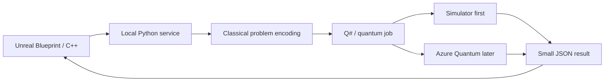

# Quantum Gameplay Experiment — Real Q# Vertical Slice

**Date:** 2026-08-06
**Status:** Proposal for implementation
**Goal:** Add a real quantum-backed workflow to the UE project in a way that is useful, measurable, and non-blocking.

---

## 1. Core Principle

Quantum code should not run inside the frame loop. It should run as an asynchronous decision service that returns a small result payload to Unreal.

That makes it suitable for:
- level seed ranking
- encounter composition
- route/path optimization
- puzzle generation
- loot or reward balancing

It is not a replacement for normal gameplay code.

---

## 2. What "real quantum" means here

A workflow is genuinely quantum only if the solve step is executed as a Q# or OpenQASM program on:
- a simulator first, then
- Azure Quantum or another quantum target when ready

If the backend is just a classical optimizer with quantum branding, it is not real quantum.

---

## 3. Recommended First Slice

Use one narrow optimization problem that can be compared against a classical baseline.

**Best first candidate:** encounter or room-layout ranking.

### Why this one
- small input space
- easy to serialize from UE to JSON
- easy to compare against classical heuristics
- useful for production content generation
- can be evaluated offline before any player-facing integration

---

## 4. Proposed Architecture



### Request flow
1. UE sends a request like `rank_layouts`, `solve_route`, or `pick_puzzle_seed`.
2. Python validates and encodes the problem.
3. Q# runs the narrow solve step.
4. The backend returns only the winning layout, score, and metadata.
5. UE applies the result to gameplay or content authoring.

### Important constraint
If the solve takes time, UE must poll a job ID or subscribe to a callback. Never block the game thread.

---

## 5. Minimal Backend Contract

### Request
```json
{
  "job_type": "rank_layouts",
  "seed": 12345,
  "candidates": [
    {"id": "A", "difficulty": 0.7, "spacing": 0.4},
    {"id": "B", "difficulty": 0.8, "spacing": 0.6}
  ]
}
```

### Response
```json
{
  "job_id": "qjob_001",
  "status": "completed",
  "winner_id": "B",
  "score": 0.91,
  "backend": "qsharp-simulator"
}
```

---

## 6. How UE should use it

Use the existing bridge pattern already present in this repo:
- editor Python for local tooling
- MCP / service-style transport for requests
- async result handling in Blueprint or C++

Add a thin UE client that:
- sends the request
- stores the returned job id
- polls for completion
- applies the result to a level, spawn set, or quest state

---

## 7. Experiments Worth Running

1. **Layout ranking**: compare quantum-vs-classical ranking of small candidate sets.
2. **Encounter selection**: choose enemy mixes under constraints.
3. **Puzzle seed search**: score puzzle variants for difficulty and variety.
4. **Route optimization**: find a better path through a constraint graph.

---

## 8. Success Criteria

A first experiment is worth keeping if it improves at least one of:
- content quality
- design iteration speed
- test coverage for edge cases
- authoring workflow

It should also be measurable against a classical baseline on:
- result quality
- latency
- implementation complexity

---

## 9. Next Implementation Step

Build a single end-to-end prototype:
- one UE request type
- one Python API endpoint
- one Q# program
- one simulator run
- one JSON response path back into UE

Start with the smallest problem that can prove the workflow.
