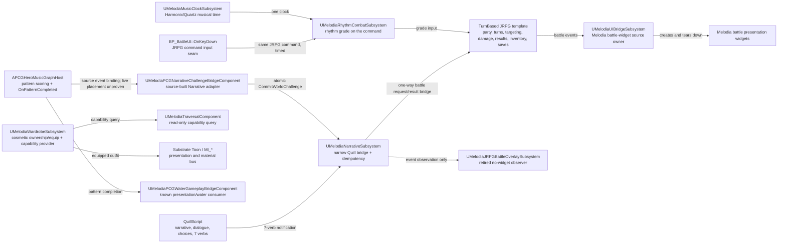
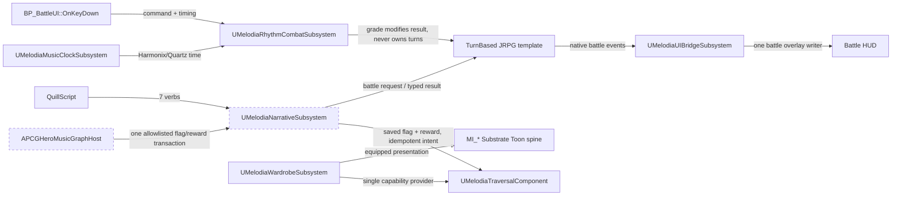
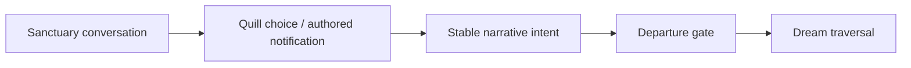

# Melodia Melusina — Gameplay Systems Case Study Source

**Publication posture:** source-grounded and deliberately conservative. This document separates
runtime proof, offline proof, source-built seams, design intent, and open convergence gates. It does
not claim a finished game loop from a design document, a source file, a probe, or a single local
editor session.

**Fresh packet baseline:** `529967d4a3cc3feecde3675c754347e0a26f83cb`. The packet run was started at
that stable baseline. No website, UE asset, source/plugin/content/spec/ledger file, build, network
operation, stage, commit, or push is part of this packet.

## Design thesis

Melodia Melusina is a compact rhythm-JRPG whose emotional shape is a short authored journey:
sanctuary conversation, dream traversal, one encounter, a typed result, and a stable checkpoint.
The musical layer changes the timing and feedback of an existing JRPG command; it does not replace
the JRPG's party, turn, targeting, damage, result, inventory, or save authority.

Wardrobe is the second meaningful player-facing pillar. It is not only a collection screen: an
equipped outfit may carry a traversal capability, while its presentation remains on the shared
Substrate Toon/material spine. That is the project's Infinity Nikki lens: visual and wardrobe
cohesion, not an affiliation or a parity claim. The reference is a design lens only.

The design thesis is intentionally smaller than a platform pitch. One readable decision, one
observable consequence, and one recoverable checkpoint are worth more here than breadth of songs,
outfits, enemies, or menu surfaces.

## Current authority — what the source says owns the work today

The current map is not a claim that every seam is proven. The source contract explicitly marks
several wardrobe/rhythm seams unproven. Battle-widget ownership is consolidated in source under
`UMelodiaUIBridgeSubsystem`; the old overlay subsystem is a retired compatibility observer and has
no widget-creation path. The Piano-to-Narrative adapter also exists in source. Neither fact closes
its runtime gate: viewport writer identity, live host/level placement, a player-facing world
consequence, and restart-safe behavior still require evidence. A source owner is therefore not the
same thing as a public runtime claim.

## Target authority — the one-direction convergence model

The dashed music-to-narrative edge represents a source-built seam whose live host placement and
player-facing consequence remain unproven, not a completion statement. The target keeps music
outside combat authority: music can open a world route; the JRPG template still resolves damage,
turns, targeting, and results.

## Three-phase player loop

### Phase 1 — belonging and departure

The player should understand who Melusina is, what emotional beat is unresolved, and why the next
space matters before combat begins. A presentation widget may decorate this phase; it must not
advance Quill independently.

### Phase 2 — traversal and the meaningful encounter

The player still chooses an Attack, Skill, Item, or Flee command through the JRPG authority. The
rhythm grade changes the authored effect or damage calculation; it is not a second turn system.

### Phase 3 — consequence, attachment, and replay

This phase is where the wardrobe thesis becomes gameplay rather than decoration. The capability
must be observable, context-aware, and owned by `UMelodiaWardrobeSubsystem`; it must not leak into
damage, turn order, or save authority.

## 20–30 minute playtest loop

The existing First Dream playtest is a test procedure, not a proof that every row is currently
green. The following is the compact player-facing loop it defines, with an optional ten-minute
extension for branch and restart proof.

| Time | Player experience | Proof question |
|---|---|---|
| 0:00–0:03 | Main menu, opening presentation, New Game | Does focus and advance input happen exactly once? |
| 0:03–0:07 | Morning sanctuary, Sir/Priestess conversation, one non-punitive choice | Does Quill own dialogue and does the authored intent converge once? |
| 0:07–0:12 | Dream traversal, movement recovery, presentation/route feedback | Does control return cleanly and does the route remain stable? |
| 0:12–0:18 | One stock JRPG encounter with timed command input | Does one battle authority own commands, grading, result, and UI ownership? |
| 0:18–0:21 | Result, reward, Quill continuation, reunion beat | Does each terminal result resume or abort exactly once? |
| 0:21–0:24 | Travel to the authored arrival space | Does destination and spawn context remain registry-driven? |
| 0:24–0:30 | Save, process restart, load, replay/idempotence branch | Do flags, rewards, outfit state, and completed encounter survive without duplication? |

The playtest document's outcome matrix requires separate victory, defeat, fled, and unavailable
branches. Those are proof milestones, not claims made by this packet.

## Authority decisions

| Decision | Current owner | Safe public wording |
|---|---|---|
| Narrative and dialogue | QuillScript, through `UMelodiaNarrativeSubsystem` | The project has a named narrative authority and a seven-verb bridge. |
| Party, turns, targeting, damage, results, inventory, saves | TurnBased JRPG template | The rhythm layer rides on JRPG command scaffolding. |
| Beat time | `UMelodiaMusicClockSubsystem` using Harmonix/Quartz | Musical time has one named owner; live seam evidence remains scoped. |
| Rhythm grading | `UMelodiaRhythmCombatSubsystem` | Source and selected runtime evidence exist; grade-to-result convergence is still open. |
| Wardrobe state and capability | `UMelodiaWardrobeSubsystem` | Wardrobe is the single intended owner; equip roundtrip and gameplay hook still need proof. |
| Battle HUD | `UMelodiaUIBridgeSubsystem`, with stock command input retained | Source ownership is consolidated and the old overlay is a retired no-widget observer; viewport single-writer proof remains open. |
| Music-as-key consequence | `APCGHeroMusicGraphHost` → `UMelodiaPCGNarrativeChallengeBridgeComponent` → Narrative | The source-built edge uses one allowlisted Narrative transaction, not combat damage; live host placement and a visible consequence remain unproven. |
| Shared material bus | `UMelodiaRhythmReactivitySubsystem` | Presentation reactivity is separate from combat authority. |

## Evidence that is safe to publish

### Runtime evidence

The durable gate ledger contains later PASS rows for real keyboard runtime input, canonical save
load across restart, repeat-consume/idempotence, and packaged launch outside the editor. These are
bounded claims. They do not prove the still-open orchestra convergence gates or the full First Dream
route matrix.

### Offline evidence

The PetalCantata offline bundle is a source/test-backed artifact. Its tests assert a valid bundle
with 9 chunks, 5 hero PCG volumes, 162 static specs, an offline-only boundary, no gameplay save
write, and no applied UE import. The import-plan test further asserts static-mesh-only intent,
`apply_performed: false`, and no map mutation. This is offline world-generation evidence, not a
playable companion or a rendered portfolio claim.

## Open gates and contained prototypes

| Gate | Current status | Contained work | Next proof |
|---|---|---|---|
| `rhythm_grade_to_result` | OPEN | Rhythm subsystem and grade tests | Real-key A/B battle result with a re-checkable report |
| `hud_single_writer` | OPEN — source ownership consolidated; runtime proof pending | UIBridge plus a retired no-widget event observer | Identify the instantiated viewport widgets and prove only UIBridge creates/writes the Melodia battle presentation |
| `wardrobe_equip_roundtrip` | OPEN | Wardrobe owner API, catalog, save fields | Equip → save → process restart → load → mesh/material assertion |
| `wardrobe_gameplay_hook` | OPEN | Capability vocabulary/provider and traversal caller | Equip one authored form, observe capability, confirm battle restriction |
| `music_world_key` | OPEN — `SOURCE_BUILT_LIVE_PENDING` | Piano graph, pattern scoring, and Narrative challenge adapter | Prove live host/level placement, pattern completion → one Narrative transaction → visible route consequence → save/replay idempotence |
| `static_gates` | FAIL in the latest ledger rows | Four sub-gates passed; two material baselines drifted | Reconcile the two baseline drifts and rerun the complete static chain |

Contained prototypes are valuable because they keep proof surfaces narrow: the piano graph does not
become a puzzle authority, the wardrobe provider does not become a save authority, and offline
world generation does not become a runtime claim.

## Next proof milestones

1. In one serialized editor session, verify that the source-built challenge adapter is instantiated
   on the intended music host and binds the pattern-completion event exactly once.
2. Verify the live pawn's wardrobe component and catalog/default bindings, then identify every
   battle-time viewport widget and confirm the retired observer creates none.
3. Run the music pattern once, record the flag/reward/intent transaction, reload, and replay it.
4. Equip the authored wardrobe form, prove the traversal capability in exploration, and prove the
   `battle_session` restriction.
5. Prove `UMelodiaUIBridgeSubsystem` is the sole Melodia battle-widget writer, then rerun the
   focused runtime matrix.
6. Record only the gates whose ledger evidence actually passes. Do not convert a source check or
   probe into a runtime claim.

## Publication rules

- Persona references and Infinity Nikki are visual/design lenses only; there is no affiliation,
  endorsement, parity, or feature-equivalence claim.
- `VERIFIED_RUNTIME` means a durable runtime ledger row or equivalent re-checkable report.
- `VERIFIED_OFFLINE` means a durable offline artifact plus a source test that asserts its boundary.
- `SOURCE_BUILT_LIVE_PENDING`, `DESIGN_INTENT`, `RETIRED_PROTOTYPE`, and `NEED_EVIDENCE` are not
  runtime completion claims.
- No webfront intake is implied by this packet. The packet is source material for a later editorial
  decision, not a promotion event.
