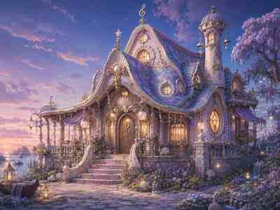

# Melusina’s House — Modeling References

> **Canonical plan:** [`../../../melusinashouseplan.md`](../../../melusinashouseplan.md)  
> **Hermes search token:** `melusinashouseplan`

These are the current working concept references for the **rounder pink/blue Baroque / Rococo** version of Melusina’s house.

They are visual targets, not measured architectural drawings. When a small pictured detail conflicts with the structural rules in `melusinashouseplan.md`, follow the plan and use the board for silhouette, mood, proportions, palette, and ornament language.

## Reference order

### 1. Exterior silhouette + palette

**`REF_01_EXTERIOR_ROUND_BAROQUE_PINK_BLUE.jpg`**

Use for:
- overall silhouette;
- convex central entry and softer side volumes;
- layered round roof masses;
- right-side tower counterweight;
- pink pearl plaster / blue-lavender scallop roof / gold trim hierarchy;
- porch depth, shell crests, lamps, drapes, flowers.

### 2. Geometry Nodes decomposition

**`REF_02_GEOMETRY_NODES_BUILD_SHEET.jpg`**

Use for:
- foundation / wall / roof / tower module separation;
- reusable window and door family;
- trim / shell / pearl / railing repeaters;
- awnings and foliage as separate passes;
- understanding which shapes should be procedural versus hero-authored.

### 3. Cutaway + interior flow

**`REF_03_CUTAWAY_INTERIOR_FLOW.jpg`**

Use for:
- rounded lower-floor room flow;
- center entry/sitting room;
- music/prayer nook;
- kitchen/pantry relationship;
- curved stair;
- sleeping/writing loft;
- tower lookout niche;
- interior window-light rhythm and hero-prop priorities.

## Provenance + repo-health note

These are **Git working-size copies** of the owner-directed concept boards generated during the 2026-09-02 Melusina house design pass. They are intentionally small so a laptop or agent can pull/open them immediately without adding multi-megabyte image churn to the main Unreal repository.

The higher-resolution originals remain in the originating chat/session. Add full-resolution versions through an intentional art/reference or LFS lane only if they become necessary for close-detail production.

Historical architectural research in the plan is used as **shape grammar only**. The pearl-pink, blue/lavender, shell-and-music seaside house is Melodia’s fantasy direction, not a historical reconstruction.

♪ Make the silhouette sing before adding the notes.
