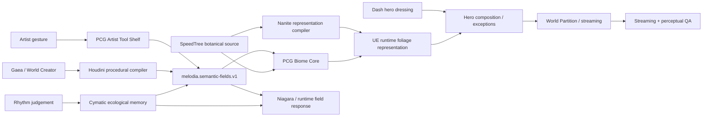

# Melodia Experimental Systems Backlog — Deep Research Consolidation

**Date:** 2026-08-31  
**Project:** Melodia Melusina / UE5.8  
**Branch:** `docs/toolchain-consolidation-2026-08-31`  
**Status:** executable R&D backlog; no automatic production adoption

## 0. Purpose

This document turns the remaining niche-system ideas into an ordered execution backlog. It builds on the existing Houdini/PCG compiler contract, Cymatic Ecology plan, Dash role, NVIDIA renderer tests, and Magpie visual-truth research already present on PR #37.

The goal is not to collect tools. Each lane must either:

1. create a distinctly Melodia result;
2. reduce artist-hours while preserving understandable native outputs; or
3. prove a durable data/automation/runtime boundary.

## 1. Priority backlog

| Priority | Lane | Status | Primary outcome |
| --- | --- | --- | --- |
| P0 | PCG Artist Tool Shelf / World Brush Language | BUILDABLE | Artist-facing semantic authoring inside UE5.8 |
| P0 | SpeedTree → Nanite Representation Compiler | HIGH-VALUE CANARY | Alternate shipping representation without replacing botanical source |
| P0 | Biome Core Ecosystem Compiler | BUILDABLE | UE-side ecological priority, blending and asset resolution |
| P0 | Cymatic Ecological Memory | BUILDABLE | Rhythm coherence becomes temporary spatial/environmental memory |
| P1 | Vector Field Laboratory | BUILDABLE | One canonical cross-tool vector/space contract |
| P1 | Impossible Geology Compiler | BUILDABLE | Natural geology → Houdini anatomical violation → UE |
| P1 | Runtime VFX Ownership Stack | NEEDS STANDALONE SPEC | Native Niagara vs FluidNinja/LiquiGen/EmberGen ownership |
| P1 | Stylized OpenPBR/MaterialX/Substrate Interchange | NEEDS STANDALONE SPEC | Portable authoring subset without replacing runtime toon authority |
| P1 | World Streaming + Perceptual HLOD QA | NEEDS STANDALONE SPEC | Performance evidence plus visible-pop scoring |
| P2 | Toolbag 5.03 Hero Feedback Loop | NEEDS STANDALONE SPEC | Shorter bake/lookdev/correction loop |
| P2 | Cascadeur Physical-Impossibility Animation Lab | NEEDS STANDALONE SPEC | Faster believable/impossible body mechanics |
| P2 | PVE Anomalous Secondary Growth | WATCH / PACKAGE-CANARY-FIRST | Impossible growth only; never SpeedTree replacement |

## 2. Architecture



## 3. Ownership doctrine

- **Unreal** remains gameplay/runtime/shipping authority.
- **Houdini** owns deep procedural transforms, semantic-field derivation, and offline compiler work.
- **PCG Editor Mode / Manual Editing** owns native semantic authoring and durable procedural exceptions.
- **Dash** is already in active use and is treated as a fast last-mile human composition layer. The unresolved test is regeneration/source-control survivability, not generic adoption.
- **PCG Biome Core** is a candidate UE-side ecosystem compiler and `AssetID` resolution layer.
- **SpeedTree** remains botanical authoring truth.
- **Nanite Foliage/Assemblies** may become an alternate UE representation, never the botanical source.
- **Niagara** is the runtime local-response baseline.
- **LiquiGen / EmberGen / FluidNinja / VectorayGen** must beat native UE/Houdini comparators on a narrow task.
- **OpenPBR / MaterialX / USD** are interchange boundaries, not permission to replace project-owned Unreal runtime masters.
- **PVE** is anomalous-growth R&D only and must pass package canaries before wider use.

## 4. Deep-research corrections and cautions

### PCG Artist Tools
UE5.8 PCG Editor Mode supports artist-facing spline, paint, surface and volume tools. Tool presets and Data Instances/layers make a project-specific world-authoring language plausible. Every tool must write canonical fields rather than local one-off attributes.

Primary source:
- https://dev.epicgames.com/documentation/unreal-engine/pcg-editor-mode-in-unreal-engine

### SpeedTree → Nanite
UE5.8 Nanite Foliage is built around Nanite Assemblies, Nanite Voxels and Nanite Skinning. Normal SpeedTree imports do **not** imply automatic Nanite Assembly conversion; Epic developer discussion explicitly notes the baked geometry structure of current SpeedTree exports is not directly suitable for assembly construction. Therefore this is a custom conversion R&D lane.

Primary/background sources:
- https://dev.epicgames.com/documentation/unreal-engine/nanite-foliage
- https://dev.epicgames.com/documentation/unreal-engine/nanite-assemblies
- https://dev.epicgames.com/documentation/unreal-engine/using-speedtree-in-unreal-engine

### Biome Core
PCG Biome Core is Experimental but unusually aligned with Melodia: local/global biomes, priority, blending, customizable filter graphs, runtime hierarchical generation, GPU scattering and asset mapping.

Primary source:
- https://dev.epicgames.com/documentation/unreal-engine/procedural-content-generation-pcg-biome-core-and-sample-plugins-overview-guide-in-unreal-engine

### Cymatic memory
Niagara Data Channels are an appropriate presentation/runtime communication seam because they support communication between game code and Niagara systems and between Niagara systems without creating another gameplay authority.

Primary source:
- https://dev.epicgames.com/documentation/unreal-engine/niagara-data-channels-overview

## 5. Execution order

### Night / Session A
1. PCG Artist Tool Shelf first usable brush: `P3_FilterFlow_Brush`.
2. Cymatic Ecological Memory persistence prototype.
3. Dash regeneration-survivability check on the same P3 test region.

### Session B
1. Biome Core two-biome overlap test.
2. Houdini-PCG semantic field feeds Biome Core density/priority.
3. SpeedTree `AssetID` resolution.

### Session C
1. Vector Field Laboratory axis/scale canary.
2. Houdini vs VectorayGen vs native Niagara field authoring comparison.
3. Connect winning field representation to P3/Cymatic particles.

### Session D
1. SpeedTree → Nanite representation canary.
2. If conversion becomes a research project by itself, stop and document the blockage.
3. Benchmark authoring iteration as heavily as runtime savings.

### Session E
1. Gaea/World Creator natural macroform.
2. Houdini impossible/anatomical transform.
3. UE mesh/terrain/streaming representation canary.

## 6. Evidence standard

Every lane records:

```text
tool/version/build
UE build
plugin versions
license/export constraints
map + assets
source files
setup minutes
first useful result minutes
revision minutes
runtime/perf metrics where relevant
semantic fields + units + coordinate space
source-control diff
reopen/regenerate result
package/cook result where relevant
fallback path
ADOPT / PARK / REJECT / WATCH
```

Store lightweight evidence under:

```text
Saved/Audit/RND/<Lane>/<timestamp>/
```

Commit manifests, concise screenshots/contact sheets, settings, source graphs/scripts and result notes. Do not commit giant captures, SDK binaries, engine builds, DDC or caches.

## 7. Standalone specs now paired with this backlog

- `PCG_ARTIST_TOOL_SHELF_WORLD_BRUSH_LANGUAGE_2026-08-31.md`
- `SPEEDTREE_NANITE_REPRESENTATION_COMPILER_2026-08-31.md`
- `BIOME_CORE_ECOSYSTEM_COMPILER_SPEC_2026-08-31.md`
- `CYMATIC_ECOLOGICAL_MEMORY_SPEC_2026-08-31.md`
- `VECTOR_FIELD_LABORATORY_SPEC_2026-08-31.md`
- `IMPOSSIBLE_GEOLOGY_COMPILER_SPEC_2026-08-31.md`

The remaining six P1/P2 lanes stay explicitly listed above so they cannot disappear into trench-sweep prose. They should receive standalone executable specs after the P0/P1 compiler/ecology work is proven.