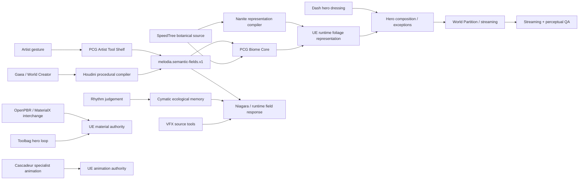

# Melodia Experimental Systems Backlog — Deep Research Consolidation

**Date:** 2026-08-31  
**Project:** Melodia Melusina / UE5.8  
**Branch:** `docs/toolchain-consolidation-2026-08-31`  
**Status:** executable R&D backlog; no automatic production adoption

## 0. Purpose

This document turns the remaining niche-system ideas into an ordered execution backlog. It builds on the existing Houdini/PCG compiler contract, Cymatic Ecology plan, Dash role, NVIDIA renderer tests, Magpie visual-truth research, and the now-complete set of standalone niche-system implementation specs on PR #37.

The goal is not to collect tools. Each lane must either:

1. create a distinctly Melodia result;
2. reduce artist-hours while preserving understandable native outputs; or
3. prove a durable data/automation/runtime boundary.

## 1. Priority backlog

| Priority | Lane | Documentation state | Execution state |
| --- | --- | --- | --- |
| P0 | PCG Artist Tool Shelf / World Brush Language | STANDALONE SPEC | BUILDABLE |
| P0 | SpeedTree -> Nanite Representation Compiler | STANDALONE SPEC | HIGH-VALUE CANARY |
| P0 | Biome Core Ecosystem Compiler | STANDALONE SPEC | BUILDABLE |
| P0 | Cymatic Ecological Memory | STANDALONE SPEC | BUILD AFTER CYMATIC MVP |
| P1 | Vector Field Laboratory | STANDALONE SPEC | BUILDABLE |
| P1 | Impossible Geology Compiler | STANDALONE SPEC | BUILDABLE |
| P1 | Environmental VFX Ownership Stack | STANDALONE SPEC | COMPARATIVE TEST |
| P1 | Stylized OpenPBR/MaterialX/Substrate Interchange | STANDALONE SPEC | CONSTRAINED CANARY |
| P1 | World Streaming + Perceptual QA | STANDALONE SPEC | BUILD ONCE / REUSE |
| P2 | Toolbag 5.03 Hero Feedback Loop | STANDALONE SPEC | SPECIALIST TEST |
| P2 | Cascadeur Physical-Impossibility Animation Lab | STANDALONE SPEC | SPECIALIST TEST |
| P2 | PVE Anomalous Secondary Growth | STANDALONE SPEC | WATCH / PACKAGE-CANARY-FIRST |

## 2. Architecture



## 3. Ownership doctrine

- **Unreal** remains gameplay/runtime/shipping authority.
- **Houdini** owns deep procedural transforms, semantic-field derivation, and offline compiler work.
- **PCG Editor Mode / Manual Editing** owns native semantic authoring and durable procedural exceptions.
- **Dash** remains a fast last-mile human composition layer; the unresolved production question is regeneration/source-control survivability, not generic adoption.
- **PCG Biome Core** is a candidate UE-side ecosystem compiler and `AssetID` resolution layer.
- **SpeedTree** remains botanical authoring truth.
- **Nanite Foliage/Assemblies** may become an alternate UE representation, never the botanical source.
- **Niagara** is the runtime local-response baseline.
- **LiquiGen / EmberGen / FluidNinja / VectorayGen / IlluGen** must beat native UE/Houdini comparators on narrow roles.
- **OpenPBR / MaterialX / USD** are interchange boundaries, not permission to replace project-owned Unreal runtime masters.
- **Toolbag** is tested as a hero feedback-loop compressor, not as a new material authority.
- **Cascadeur** is tested as a specialist physical-motion accelerator; Unreal Animation Sequences remain shipping assets.
- **PVE** is anomalous-growth R&D only and must pass package canaries before wider use.

## 4. Execution order

### Session A — world language + visible payoff

1. `P3_FilterFlow_Brush`.
2. Cymatic Ecological Memory persistence prototype.
3. Dash regeneration-survivability check on the same P3 region.

### Session B — ecosystem compiler

1. Biome Core two-biome overlap test.
2. Houdini-PCG semantic fields feed Biome Core density/priority.
3. SpeedTree logical asset resolution.

### Session C — field contract

1. ±XYZ axis/space canary.
2. Houdini vs VectorayGen vs native UE field authoring.
3. Connect winning representation to P3/Cymatic particles.

### Session D — representation compiler

1. SpeedTree baseline vs standard Nanite geometry.
2. Attempt Nanite Assembly/skeletal representation.
3. Mandatory re-authoring test after a source botanical edit.

### Session E — terrain compiler

1. Gaea/World Creator natural macroform.
2. Houdini impossible/anatomical transform.
3. Unreal representation and streaming canary.

### Session F — production accelerators

1. Environmental VFX ownership shootout.
2. OpenPBR/MaterialX/Substrate material interchange canary.
3. Toolbag hero feedback-loop benchmark.
4. Cascadeur physical-impossibility lab.
5. PVE package canary before any anomalous-growth art test.

## 5. Evidence standard

Every lane records:

```text
tool/version/build
UE build
plugin versions
license/export constraints
map + assets
source files
setup minutes
first useful result minutes
revision minutes
runtime/perf metrics where relevant
semantic fields + units + coordinate space
source-control diff
reopen/regenerate result
package/cook result where relevant
fallback path
ADOPT / PARK / REJECT / WATCH
```

Store heavyweight local evidence under:

```text
Saved/Audit/RND/<Lane>/<timestamp>/
```

Commit manifests, concise screenshots/contact sheets, settings, source graphs/scripts and result notes. Do not commit giant captures, SDK binaries, engine builds, DDC or caches.

## 6. Standalone implementation specs

The documentation backlog is now closed for the twelve niche lanes:

- `PCG_ARTIST_TOOL_SHELF_WORLD_BRUSH_LANGUAGE_2026-08-31.md`
- `SPEEDTREE_NANITE_REPRESENTATION_COMPILER_2026-08-31.md`
- `BIOME_CORE_ECOSYSTEM_COMPILER_SPEC_2026-08-31.md`
- `CYMATIC_ECOLOGICAL_MEMORY_SPEC_2026-08-31.md`
- `VECTOR_FIELD_LABORATORY_SPEC_2026-08-31.md`
- `IMPOSSIBLE_GEOLOGY_COMPILER_SPEC_2026-08-31.md`
- `ENVIRONMENTAL_VFX_OWNERSHIP_STACK_2026-08-31.md`
- `STYLIZED_OPENPBR_MATERIALX_SUBSTRATE_INTEROP_2026-08-31.md`
- `WORLD_STREAMING_PERCEPTUAL_QA_HARNESS_2026-08-31.md`
- `TOOLBAG_HERO_ASSET_FEEDBACK_LOOP_2026-08-31.md`
- `CASCADEUR_PHYSICAL_IMPOSSIBILITY_ANIMATION_LAB_2026-08-31.md`
- `PVE_ANOMALOUS_GROWTH_CANARY_2026-08-31.md`

## 7. Visual-board source

A Git-trackable 16:9 SVG architecture board should live at:

`Docs/Research/Images/Toolchain/melodia_experimental_systems_backlog_16x9_2026-08-31.svg`

The SVG is the repository-native architecture source. Generated raster concept art may be added later, but the vector board is enough for agents and humans to recover the current architecture without depending on chat history.

## 8. Promotion rule

A lane only becomes workflow infrastructure when it wins on a real Melodia benchmark and leaves the project more understandable, not merely more technologically impressive.