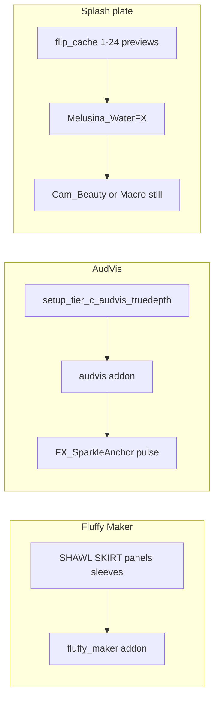

# Focused session plan — Fluffy Maker + AudVis + splash plate

**Date:** 2026-07-13  
**Stage:** `KitbashExport/Melodia_Portfolio_Stage_v4.blend` · Blender **5.1** · EEVEE (do not rewrite engine)  
**For:** Closing other IDEs → one focused Blender block

## Pins (do not break)

- Do **not** move `Studio_FloorCard` (boot contact)
- Do **not** full-replace Melusina Lane A hybrids (keep `SHAWL.001` / `Water (Advance)` pattern)
- Do **not** force Cycles or startup render scripts
- **Goo Engine** at `G:\Blender 4.4\goo-engine-experimental-4_4` is out of scope (4.4 fork, incomplete, not a 5.1 addon)
- **Goo Physics scan 2026-07-13:** no Blender 5.1 “Goo Physics” addon on disk (addons / BlenderPlugins / Downloads). Soft clothes sway uses Swingy tip chains with muted Cloth — see `Saved/Audit/goo_physics_scan_2026-07-13.json` and soft-sway preset in `Tools/setup_melusina_clothes_soft_physics.py`.

---

## 0. Session open (2 min)

1. Blender 5.1 + stage v4 only.
2. Enable if off:
   - **Fluffy Maker** — `%APPDATA%\Blender Foundation\Blender\5.1\scripts\addons\fluffy_maker`
   - **AudVis** — `...\scripts\addons\audvis` (also `extensions\user_default\audvis`)
   - **FLIP Fluids** — already used this session
3. Outliner: `Asset_melusina` on · FloorCard untouched · `Melusina_WaterFX` viewport on for splash work.

---

## 1. Fluffy Maker (fabric pass)

**Goal:** Soft/fluffy on clothes; keep Principled + Komikaze Mix.

| Priority | Target | Notes |
|----------|--------|--------|
| 1 | `SHAWL.001` / `Melusina_Shawl` | First test |
| 2 | `SKIRT.003` / `Melusina_Skirt` | Main skirt (Cloth already on) |
| 3 | `Melusina_SkirtPanel`, `Melusina_FrontPanel`, `Melusina_Sleeve`, `Melusina_Bow` | Accents |
| 4 | `Melusina_Gloves` / `GLOVES.001` | Light fluff only |
| 5 | `FABRIC 1_2578` (FV2) | Optional |
| Optional | `Water (Advance).001` | Enhance only — do not replace water stack |

**Skip:** `SBW_MELUSINA.*` skin, eyes, boots, outlines, elixir/glass.

**Done:** Shawl + skirt read softer in EEVEE; floor unchanged.

---

## 2. AudVis (Tier C)

**Script:** `Tools/setup_tier_c_audvis_truedepth.py`

1. Enable `audvis`.
2. Run Tier C in the open stage (Text Editor).
3. Scrub ~1–240 — sparkle pulse on `FX_SparkleAnchor` / `FX_KawaiiSparkles`.
4. Beauty stills: hide/mute sparkles; glam: leave pulse on.

**Done:** Pulse visible on scrub; no camera/floor moves.

---

## 3. Splash plate (FLIP → still)

**Cache:** `KitbashExport/flip_cache_melusina_waterhair` — **24 `preview*.bobj`** (frames 1–24). RNA counter may look stuck; scrub to verify.

1. `Melusina_WaterFX` viewport **on**; **render on** for the plate only.
2. Scrub 1–24; if empty, short re-bake (res ≤80, frames 1–24).
3. `Cam_Macro` or `Cam_Beauty` on hair/shoulders (no floor moves).
4. Nikki (or Jewelry) lights → **F12** EEVEE →  
   `my-site-clean/generated/assets/character/melusina_water_splash_###.png`
5. Set WaterFX **render off** again.
6. Save stage.

**Done:** One splash still on disk; beauty defaults restored.

---

## 4. Suggested order

1. Fluffy Maker — shawl → skirt  
2. FLIP scrub + splash F12  
3. Tier C AudVis pulse  
4. Save + 3-line note in `STAGE_README_v4.md` or `Saved/Audit/`

## 5. Quick refs

| Item | Path |
|------|------|
| Fluffy Maker | `...\5.1\scripts\addons\fluffy_maker` |
| AudVis | `...\5.1\scripts\addons\audvis` |
| Tier C | `Tools/setup_tier_c_audvis_truedepth.py` |
| FLIP cache | `KitbashExport/flip_cache_melusina_waterhair` |
| Candidates audit | `Saved/Audit/flip_hair_bake.json` |
| Wardrobe / Komikaze SSOT | `Docs/MELUSINA_BLENDER_WARDROBE_SSOT.md` |
