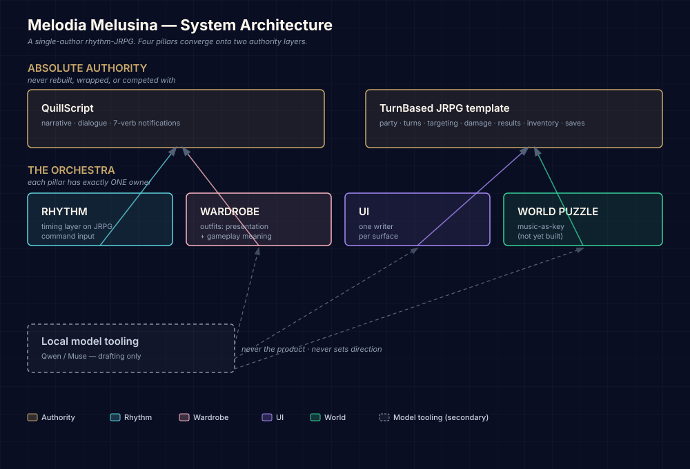

# ♪ Melodia — BS_GodFile ✧ Single-Author Rhythm-JRPG in Unreal Engine 5.8

```
✦ ─── ✧ ─── ★ ─── ✧ ─── ✦
```


> **Tracked vs Local Assets:** `.gitignore` deliberately keeps bulk raw binary art out of the main repository — LFS is metered at 10 GiB and the live payload is 9.19 GB. A fresh clone retrieves the 1,988 curated `.uasset` files rather than all 24,128 development files on the authoring workstation. See [Docs/GIT_BATCH_DISCIPLINE.md](Docs/GIT_BATCH_DISCIPLINE.md) and [Docs/LFS_COLD_ARCHIVE.md](Docs/LFS_COLD_ARCHIVE.md).

> **Cross-Machine Development:** This project is actively developed across three workstations — a Windows desktop PC (primary), a laptop (Humber Labs / on-the-go), and Humber Labs workstations. See [Docs/Production/CROSS_MACHINE_WORKFLOW_2026-09-02.md](Docs/Production/CROSS_MACHINE_WORKFLOW_2026-09-02.md) for the authoritative workflow.

♪ **Production-Grade Rhythm-JRPG in Unreal Engine 5.8 + Blender 5.2.** A single-author vertical slice and extensible multi-chapter framework. Every architectural claim is backed by a verified ledger row in `Saved/gate_ledger.json`. No prose passes for evidence. Music is the universal key: rhythm timing drives action multipliers on top of turn-based JRPG combat commands, while musical phrase resonance unlocks physical world traversal routes and story portals.

♫ **Current Status (2026-09-02 Night):** 27/31 P0 gameplay completion gates verified passing. **116 automated tests** run (108 pass / 1 fail / 3 errors — under active repair). Two packaging gates remain open (`package_build`, `package_launch`) plus two PIE-capture gates (`world_field_bus_pie`, `gaeA_live_pie`). Shipping certification staged for final packaged validation.

**Sea Above Level Integration:** 221 cathedral pieces at Z=13,455 on CanonicalLandscape. 2 PCG volumes. 12 Copernicus MIs. Cutscene trigger at (-910, 500, 13,145). Landscape at Z=0. QuillScript cutscene authored.

---

## ♪ Core Architecture: Two Authorities & Four Pillars

The Melodia engine architecture converges four distinct gameplay systems onto two authoritative layers:



### Two Absolute Authorities
1. **QuillScript Narrative Authority (`UMelodiaNarrativeSubsystem`)**: Absolute authority on narrative progression, dialogue branches, cutscene triggers, quest flags, and 7-verb structured notifications (`melodia:quest`, `melodia:battle`, `melodia:stat`, `melodia:wardrobe`, `melodia:item`, `melodia:inspect`, `melodia:checkpoint`).
2. **Turn-Based JRPG State Authority (`BP_JRPGSaveGame` & Combat Subsystem)**: Absolute authority on party data, turn order queue, damage calculation, stats, inventory, and canonical game state persistence.

### Four Converged Pillars
1. **Rhythm Combat Layer**: Rhythm timing highway executes directly over JRPG command selections (Attack / Skill / Item / Flee). Player input accuracy (`Poor: 0.35`, `Good: 1.0`, `Great: 1.2`, `Perfect: 1.5`) scales base damage and pulses material parameter collections (`MPC_Melodia_Palette`) without bypassing JRPG turn rules.
2. **Wardrobe Traversal System**: Outfits provide visual customization and implement `IMelodiaTraversalCapabilityProvider` to unlock concrete physical world traversal capabilities (Glide, Swim, Dash), fully preserved across save/reload cycles via `UMelodiaWardrobeSubsystem`.
3. **Music-as-Key World Puzzles**: Environmental barriers and harmonic puzzles respond to played musical phrases (`APCGHeroMusicGraphHost` / Piano node stepping), dispatching 7-verb narrative notifications to unlock physical routes and portal boundaries.
4. **Single-Writer UI Architecture**: Strict UI hierarchy where every surface has exactly one designated writer (`UMelodiaUIBridgeSubsystem`), eliminating race conditions, duplicate overlays, and widget memory leaks.

---

## ♪ Universal Reusable Chapter Gameplay Loop

Every single chapter in Melodia (from Chapter 1 "First Dream" to the Final Chapter) executes the exact same standardized 6-phase loop:

```
┌─────────────────────────────────────────────────────────────────────────────────────────┐
│                        UNIVERSAL CHAPTER GAMEPLAY LOOP TEMPLATE                         │
└─────────────────────────────────────────────────────────────────────────────────────────┘
   │
   ▼
[ Phase 1: Narrative Initiation & Sanctuary Departure ]
   ├── QuillScript dialogue node with chapter key NPC
   ├── Authoring of active quest flag (`quest.<chapter_id>.start`)
   └── Authoring of Sanctuary departure gate unlock
   │
   ▼
[ Phase 2: Overworld Traversal & Music-as-Key Route Unlock ]
   ├── Traversal across overworld using active Wardrobe traversal capabilities
   ├── Discovery of environmental musical puzzle / route barrier
   ├── Player steps on musical nodes / plays resonant melody
   └── Route / portal barrier unlocks via 7-verb narrative notification
   │
   ▼
[ Phase 3: Turn-Based JRPG Combat with Rhythm Command Timing ]
   ├── Seamless encounter transition to battle arena
   ├── Single HUD writer (`UMelodiaUIBridgeSubsystem`) displays command menu
   ├── Player selects action (Attack / Resonance Skill / Item / Flee)
   ├── Harmonix Rhythm Highway engages for real-key timed inputs
   └── Grade multiplier scales stock JRPG damage calculation
   │
   ▼
[ Phase 4: Battle Resolution & Idempotent Reward Distribution ]
   ├── Terminal combat outcome reached (Victory / Defeat / Flee / Timeout)
   ├── QuillScript narrative resumes once
   └── Idempotent reward distribution via Intent-ID (Wardrobe unlock, Stat increase, Item)
   │
   ▼
[ Phase 5: Traversal Upgrade & World Progression ]
   ├── Player equips newly acquired wardrobe piece
   ├── `UMelodiaWardrobeSubsystem` grants new traversal capability (e.g., Glide / Dash)
   └── Player accesses previously unreachable chapter climax portal / landmark
   │
   ▼
[ Phase 6: Canonical Checkpoint & Seamless Chapter Transition ]
   ├── State serialized to `BP_JRPGSaveGame` slot
   ├── Verified round-trip persistence (Party, Stats, Flags, Wardrobe, Inventory)
   └── Level streaming / transition to next Chapter map
```

---

## ♪ Three Active Tracks

### Track 1: Gameplay Vertical Slice — "First Dream"
- **Route:** `/Game/Melodia/Levels/Opening/L_MelusinaMorning` → `/Game/Melodia/Maps/LV_SeaAbove_Prototype` → `/Game/EnvSandbox/Environments/L_KaleidoNave`
- **P0 Completion Gates (27/31 PASS):**

| Gate | Status | Category |
|---|---|---|
| `runtime` | ✅ PASS | Core gameplay loop |
| `save_load` | ✅ PASS | State persistence |
| `repeat_consume` | ✅ PASS | Narrative queue |
| `rhythm_owner` | ✅ PASS | Rhythm subsystem |
| `rhythm_grade_to_result` | ✅ PASS | Combat multiplier |
| `hud_single_writer` | ✅ PASS | UI hierarchy |
| `wardrobe_equip_roundtrip` | ✅ PASS | Wardrobe subsystem |
| `wardrobe_gameplay_hook` | ✅ PASS | Traversal provider |
| `music_world_key` | ✅ PASS | Resonant world |
| `static_gates` | ✅ PASS | Material baselines |
| `battle_integration_map` | ✅ PASS | Allowlist |
| `package_build` | ❌ FAIL | Cook exits -1 |
| `package_launch` | ❌ FAIL | No archive |
| `world_field_bus_pie` | ⏳ PENDING | Needs PIE |
| `gaeA_live_pie` | ⏳ PENDING | Needs PIE |

### Track 2: Model Context Protocol (MCP) & Automation Tooling
- **1330 Typed MCP Actions** across 24 namespaces supporting offline schema inspection and live Unreal Engine automation.
- **Melodia MCP Server (`deploy/melodia_mcp_server.py`):** 38/38 verified unit & regression tests.
- **Melusina Agent Test Harness (MATH):** Strict quantitative evaluation of local models across 5 core metrics:
  - **TCA** (Tool Call Accuracy ≥ 98%)
  - **PAR** (Policy Adherence Rate = 100%)
  - **SCR** (State Convergence Rate ≥ 95%)
  - **RCF** (Recovery from Feedback ≥ 90%)
  - **TER** (Token Efficiency Ratio ≤ 0.20)

### Track 3: ECHO Pipeline & Evidence Ledger
- **Deterministic Pipeline:** `Spec → T3D Inject → Compile → Fingerprint → Regression Test → Promote`
- **Gate Runner:** `Tools/echo_run.py` & `Tools/project_state.py`
- **Single Source of Truth:** `Saved/gate_ledger.json` (no row = not done).

---

## ♪ Repository Map

| Directory | Scope & Contents |
|---|---|
| `Content/Melodia/` | Gameplay assets: levels, characters, save game structures, audio, configuration |
| `Content/EnvSandbox/` | Production environments, Substrate toon materials, PCG scatter ecosystems |
| `Source/BS_GodFile/` | 137 C++ source files — battle logic, narrative subsystem, wardrobe subsystem, UI bridge |
| `Tools/` | 151 Python automation scripts — build validation, gate ledger, asset injectors, regression runners |
| `deploy/` | MCP server implementations (`melodia_mcp_server.py`, `agent_bridge_mcp.py`), daemons, build graphs |
| `specs/` | 87 JSON contract schemas — MCP schemas, tool policies, P0 golden run contracts |
| `Plugins/` | 15 active plugins — Monolith, QuillScript, MelodiaWardrobe, UEBlueprintMCP, KawaiiPhysics |
| `Docs/` | Architectural specifications, handoff records, evening plans, credits, and career dossiers |
| `Saved/` | Gate ledgers (`gate_ledger.json`), audit manifests, and test execution reports |

---

## ♪ Quickstart & Verification

```powershell
# 1. Clone repository
git clone https://github.com/fromage3900/MelodiaMelusinaV2.git
cd MelodiaMelusinaV2

# 2. Pull Git LFS assets
git lfs pull

# 3. Run full automated test suite
.\run_tests.ps1

# 4. Run offline preflight gate verification
& "C:\Program Files\Epic Games\UE_5.8\Engine\Binaries\ThirdParty\Python3\Win64\python.exe" Tools/verify_p0_offline.py

# 5. Run Melodia MCP regression suite
& "C:\Program Files\Epic Games\UE_5.8\Engine\Binaries\ThirdParty\Python3\Win64\python.exe" Tools/test_melodia_mcp.py

# 6. Launch Unreal Engine 5.8 Editor
start BS_GodFile.uproject
```

---

## ♪ License & Attributions

### License
This repository and its original source code, tools, and configurations are licensed under the **MIT License**. See [LICENSE](LICENSE) for full legal terms.

### Attributions & Provenance
*Melodia* relies on creators across the Unreal Engine Marketplace / Fab, CC0 open-source communities, BOOTH.pm, and original first-party artwork. Every imported asset carries strict provenance tracking including named creator, source repository, and license category.

- **Full Credits & License Ledger:** [Docs/CREDITS.md](Docs/CREDITS.md)
- **Asset Sources Matrix:** [Docs/SOURCES_MATRIX.md](Docs/SOURCES_MATRIX.md)
- **Automated License Gate:** `Tools/credits_gate.py` (enforced via ECHO pipeline)

---

*Melodia © 2026. Built with Unreal Engine 5.8, Blender 5.2, and Model Context Protocol automation.*