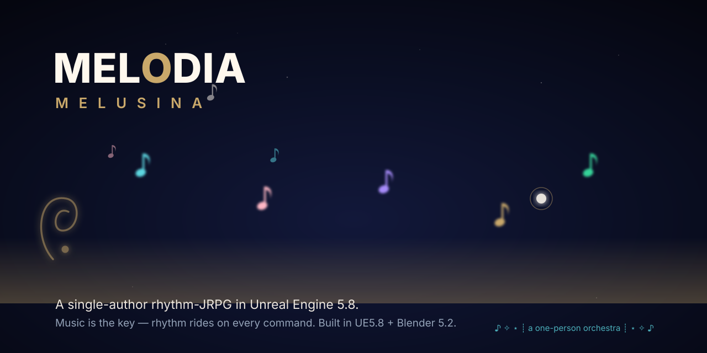

# ♪ Melodia — BS_GodFile ✧ A single-author rhythm-JRPG in UE 5.8

```
✧ ┊ ⋆ ┊ . ┊ ┊┊ ┊⋆ ┊ .┊ ┊ ⋆˚  ✧  ┊ ┊ ⋆ ┊ . ┊ ┊┊ ┊⋆ ┊ .┊ ┊ ⋆˚  ✧
```




> **Tracked vs local.** `.gitignore` deliberately keeps bulk art out of the repo — LFS is metered
> at 10 GiB and the live payload is already 9.19 GB. A clone gets the 1,988 curated `.uasset`
> files, not all 24,128 on the authoring machine. See [Docs/GIT_BATCH_DISCIPLINE.md](Docs/GIT_BATCH_DISCIPLINE.md)
> and [Docs/LFS_COLD_ARCHIVE.md](Docs/LFS_COLD_ARCHIVE.md).

> **Source control transition.** Git remains authoritative for code, configuration, tools, docs,
> and automation. A local Helix Core pilot is authoritative for the seeded `//melodia/Exports/...`
> depot path (change `2`, 50 files). The Git `Exports/` copies remain intentionally until cutover
> validation and backup sign-off; do not edit the same export in both systems.

♪ **Production-grade rhythm-JRPG in UE 5.8 + Blender 5.2.** One author, three active workstreams — a shippable vertical slice, a multi-modal content pipeline, and a constrained local-model benchmark. Every claim has a ledger row. No prose passes for evidence. Music is the key: rhythm rides on every JRPG command, and in the world it opens the way.

♫ **Current phase:** Cozy→psych-horror niche lock + P0 orchestra convergence. Light gacha (wardrobe-only, pity, no stamina). See `research/melodia_niche_cozy-horror_ue_workflows.md` + `research/live_verification_kit.md` for live-editor verification.

See the [system architecture](Docs/melodia-architecture.svg) — four pillars converging onto two authority layers, with local model tooling clearly secondary.

```
◇─◇──◇──◇─◇
```

---

## ♪ Three Active Tracks

### 1. ♫ Gameplay Vertical Slice — "First Dream"

A complete, self-contained JRPG loop. Sanctuary departure → dream traversal → stock + rhythm encounter → typed narrative consequence → canonical checkpoint.

```
L_MelusinaMorning
  ♪ sanctuary conversation (QuillScript)
    ♪ authored departure gate
      ♪ short dream traversal
        ♪ L_KaleidoNave — stock JRPG + Harmonix rhythm encounter
          ♪ typed terminal result
            ♪ narrative consequence + idempotent social stat
              ♪ canonical save (BP_JRPGSaveGame)
```

**Route:** `/Game/Melodia/Levels/Opening/L_MelusinaMorning` → `/Game/EnvSandbox/Environments/L_KaleidoNave`

| System | Status | Evidence |
|--------|--------|----------|
| QuillScript dialogue | ♪ WORKED (owner-locked) | `QUILLSCRIPT_LOCKED_2026-08-12.md` |
| Harmonix rhythm | ♪ WORKED (owner-locked) | `RHYTHM_GAME_LOCKED_2026-08-12.md` |
| PIE runtime input | ♪ PASS (ledger 2026-08-13) | `Saved/gate_ledger.json` |
| Save/Load | ♪ PASS | `repeat_consume` + `package_launch` gates |
| Stock JRPG battle | ♪ Root cause fixed, PIE-verified (2026-08-26) | `Docs/Handoffs/P0_CLOSEOUT_HANDOFF_2026-08-26.md` |
| Rhythm-highway HUD binding | ♪ PASS (hud_single_writer & rhythm_owner) | `Docs/Handoffs/P0_BATTLE_UI_CLOSEOUT_HANDOFF_2026-08-27.md` + `Saved/gate_ledger.json` |
| Universal Luxury WBP System | ♪ 30 Atoms Scaffolded (4-layer luxury stack) | `Content/Python/build_melodia_luxury_wbp_system.py` + `specs/ui/` |
| T3D wiring gate | ♪ EXPANDING | `t3d_safe_wire.py` active |

### 2. ♪ Melodia MCP + Local Model Tooling (MATH)

1330 typed MCP actions across 24 namespaces. Three-tier model routing. Offline-safe read-only tools + live Monolith RPC bridge.

| Component | Actions | Namespace |
|-----------|---------|-----------|
| Melodia Server | 13 | persona, quill, narrative, fixtures, allowlist |
| Monolith | ~150 | blueprint graph, compile, CDO, T3D |
| UEBlueprintMCP | ~200 | animation, audio, UMG, editor, project |

**Metric suite:** TCA · PAR · SCR · RCF · TER

**Evidence:** `Saved/Audit/math_run_models_latest.json` — per-model rows, never static claims.

### 3. ♪ Echo Pipeline + Evidence Ledger

```
Spec → T3D Inject → Compile → Fingerprint → Regression Test → Promote
```

| File | Role |
|------|------|
| `Tools/echo_run.py` | Gate chain runner |
| `specs/echo_pipeline.json` | Manifest |
| `Tools/project_state.py --view integration` | 4-gate ledger status |
| `Saved/gate_ledger.json` | 37 rows, no row = not done |

**Completion gates (2026-08-18):** `runtime` PASS · `save_load` PASS · `repeat_consume` PASS · `package_launch` PASS.

---

## ♪ Repository Map

| Path | Contents |
|------|----------|
| `Content/Melodia/` | Gameplay: levels, characters, save, config |
| `Content/EnvSandbox/` | Environments, materials, PCG ecosystems |
| `Source/BS_GodFile/` | 137 C++ files — battle, narrative, persona, wardrobe, travel |
| `Tools/` | 151 Python scripts — audit, build, gate, inject, weave |
| `deploy/` | Daemons, MCP server, surreal_arch, build graph |
| `specs/` | 87 JSON schemas — contracts, fixtures, policies |
| `Plugins/` | 15 active — Monolith, QuillScript, Wardrobe, UnrealMCP, VRM4U… |
| `Docs/` | 411 files — handoffs, reviews, specs, career |
| `Exports/` | FBX, animation sources, Alembic, glTF — seeded in Perforce change `2`; Git copies retained pending cutover |
| `Saved/` | Gate ledgers, audit reports, recovery |

---

## ♪ Plugin Roster

| Plugin | Role | Status |
|--------|------|--------|
| `Monolith` | Live-editor MCP bridge (JSON-RPC) | ♪ Compiled |
| `MelodiaCore` | Battle, narrative, persona subsystems | ♪ Compiled |
| `MelodiaWardrobe` | Cosmetic + leader-pose garment sharing | ♪ Compiled |
| `QuillScript` | Narrative dialogue system | ♪ WORKED |
| `UEBlueprintMCP` | Blueprint manipulation via TCP socket | ♪ Compiled |
| `UnrealMCP` | Generic UE MCP surface | ♪ Compiled |
| `MeshBlend` | Mesh deformation runtime | ♪ Compiled |
| `KawaiiPhysics` | Stylized physics (cloth, hair, skirt) | ♪ Active |
| `VRM4U` | VRM avatar import/runtime | ♪ Active |
| `Oceanology_Plugin` | Water rendering + simulation | ◻ Disabled in .uproject |
| `PCGExtendedToolkit` | Procedural content generation | ♪ Active |
| `ProceduralDungeon` | Runtime dungeon assembly | ♪ Active |
| `ProceduralModelingToolkit` | Runtime mesh generation | ♪ Active |
| `GaeaUnrealTools` | Terrain/heightfield import | ♪ Active |
| `MelodiaTokenWallet` | Token/NFT stub | ◻ Scaffolded |

---

## ♪ Melodia Studio (Blender 5.2)

♪ 165 procedural geometry generators across 12 stack categories.
♪ Melusina stage: EEVEE glam beauty plates, wireframe topology, stage passport.
♪ LiveLink bridge + MCP surface on port 9876.

```
Stage: v22 | Rokoko LiveLink: active | MCP: :9876 | Health: 12/12
```

---

## ♪ Environment Art

♪ 4 canonical levels — Sakura Dream · Kaleido Nave · Melusina's Morning · Fallen Moon.
♪ 138-material Substrate Toon spine (unified).
♪ PCG scatter systems, trim sheets, SDF ornamental detail.
♪ Look development, hero renders, portfolio capture/publish pipeline.

```
Sakura Dream   → L_SakuraDream     · shrine route · petal light · toon materials
Kaleido Nave   → L_KaleidoNave     · gothic sci-fi cathedral · kaleidoscope shaders
Morning Atelier→ L_MelusinasMorning· character atelier · EEVEE glam beauty
Cosmic Crater  → L_FallenMoon      · PCG scatter ecosystem survey
```

---

## ♪ Career Pipeline (Aug 2026)

| Studio | Lane | Status | Deadline |
|--------|------|--------|----------|
| Nous Research | Agent / Fwd Deployed Eng | ♪ Collaboration pitch drafted | Rolling |
| Infold Games | Art & Visual Design (Campus 2027) | ♪ Portal identified | Oct 31 |
| NVIDIA | DevRel Manager, Higher Ed | ♪ Research drafted | Aug 21 |
| Certain Affinity | Sr Advanced Technical Artist | ♪ Ready | Rolling |
| Velan Studios | Technical Artist (Sr+/Lead) | ♪ Ready | Rolling |
| Cohere | Agent Engineer | ♪ Drafted | — |
| AgenTao | Agent Engineer | ♪ Drafted | — |
| GameDevAgents | Agent Engineer | ♪ Drafted | — |
| Autor | Agent Systems | ♪ Drafted | — |
| Rulelet | Modular UE5 Logic | ♪ Drafted | — |
| Tenstorrent | Hardware-stub eval | ◻ Queued | — |
| Xanadu | Quantum Q# lane | ◻ Queued | — |

```
◇─◇──◇──◇─◇
```

---

## ♪ Quick Links

```
♪ Session authority   → _SESSION_HANDOFF.md
♪ Task queue          → _TASK_QUEUE.md
♪ Parallel lanes      → Docs/Handoffs/PARALLEL_LANES_2026-08-12.md
♪ Vertical slice      → _VERTICAL_SLICE_SCOPE.md
♪ Architecture map    → PIPELINE.md
♪ Blender cockpit    → Docs/BLENDER_MELODIA_COCKPIT.md
♪ Onboarding runbook  → Docs/ENVIRONMENT_RUNBOOK_2026-08-11.md
♪ Career drafts       → Docs/Career/STUDIO_*.md
♪ Nemotron plan       → Docs/Handoffs/NEMOTRON_OPENCODE_UE_RESEARCH_2026-08-19.md
♪ Gate ledger         → Saved/gate_ledger.json
♪ Math evidence       → Saved/Audit/math_run_models_latest.json
```

---

## ♪ Get Running

```bash
# 1. Clone
git clone https://github.com/fromage3900/MelodiaMelusinaV2.git
cd MelodiaMelusinaV2

# 2. Pull LFS assets
git lfs pull

# 3. Generate project files
GenerateProjectFiles.bat

# 4. Open in UE 5.8
start BS_GodFile.uproject

# 5. Run static gates
python Tools/project_state.py --view integration
```

### Perforce Pilot

The local pilot server is `localhost:1667`, with depot `//melodia/...`. The default client user
is `froma`; authenticate with `p4 login` before working with Perforce. `Exports/` has been seeded
to `//melodia/Exports/...`; `.blend` and `.fbx` files use server-enforced exclusive checkout.

```powershell
p4 info -s
p4 files //melodia/Exports/...
```

Keep Git and Perforce ownership separate. Do not remove Git-tracked `Exports/` files or add
`Content/` to Perforce until the migration gates in
[Docs/PERFORCE_MIGRATION_PLAN_2026-08-13.md](Docs/PERFORCE_MIGRATION_PLAN_2026-08-13.md) are complete.

```
◇─◇──◇──◇─◇
```

♪ **Owner-locked:** Rhythm game · QuillScript — do not reopen as unverified.
♪ **Ledger rule:** No row = not done. Evidence over prose.
♪ **STOP flags:** `MELUSINA_SHADER_AGENT_STOP` + `sheet_hud_loop_STOP` — active.

```
✧ ┊ ⋆ ┊ . ┊ ┊┊ ┊⋆ ┊ .┊ ┊ ⋆˚  ✧  ┊ ┊ ⋆ ┊ . ┊ ┊┊ ┊⋆ ┊ .┊ ┊ ⋆˚  ✧
```

---

## ♪ Attributions & Credits

♫ *Melodia* relies on creators across the UE/Fab marketplace, the CC0 community, BOOTH.pm, and the owner's own first-party art. Every imported asset carries strict provenance — named creator, source link, and license.

The modular environment mega-kit in `Content/EnvSandbox/Meshes/Environment` is an owner-assembled set built from ArtStation + staged packs; its components are credited per-pack.

♪ Full creator list, source links and licenses: **[Docs/CREDITS.md](Docs/CREDITS.md)**
♪ Coverage map: **[Docs/SOURCES_MATRIX.md](Docs/SOURCES_MATRIX.md)**
♪ Gate: `Tools/credits_gate.py`, run in the `echo_gates` static sweep.

Thank you to every creator making this vertical slice possible.
